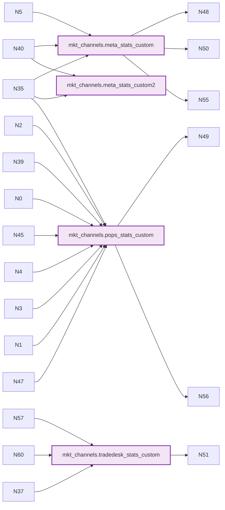

# BigQuery Project Documentation: level-hope-462409-a8 (Filtered)

_Generated automatically from BigQuery metadata - Filtered for specific tables_

## Summary

- **Total Datasets**: 1
- **Total Tables**: 0
- **Total Views**: 3
- **Total Objects**: 3

## Table of Contents

- [Summary](#summary)
- [Relationships Overview](#relationships-overview)
- [mkt_channels](#mkt-channels)

## Relationships Overview

This diagram shows how views depend on tables and other views:



## mkt_channels

**Location**: US
**Created**: 2025-09-12 08:37:10.475000+00:00
**Modified**: 2025-09-12 08:37:10.475000+00:00

**Tables**: 10 | **Views**: 4


### Views in mkt_channels

#### meta_stats_custom

**Full Name**: `level-hope-462409-a8.mkt_channels.meta_stats_custom`
**Created**: 2025-09-15 14:17:21.034000+00:00
**Modified**: 2025-10-29 13:04:51.930000+00:00

**Dependencies**: This view depends on 3 object(s):
- `1.0.0`
- `level-hope-462409-a8.level-hope-462409-a8.mkt_channels`
- `level-hope-462409-a8.mkt_channels.meta_stats`

**Schema**:

| Column Name | Type | Mode | Description |
|-------------|------|------|-------------|
| date_start | DATE | NULLABLE |  |
| account_id | STRING | NULLABLE |  |
| adname_custom | STRING | NULLABLE |  |
| adset_name_custom | STRING | NULLABLE |  |
| campaign_name_custom | STRING | NULLABLE |  |
| spend | NUMERIC | NULLABLE |  |
| impressions | NUMERIC | NULLABLE |  |
| clicks | NUMERIC | NULLABLE |  |
| reach | NUMERIC | NULLABLE |  |
| frequency | NUMERIC | NULLABLE |  |
| publisher_platform | STRING | NULLABLE |  |
| platform_position | STRING | NULLABLE |  |
| device_platform | STRING | NULLABLE |  |
| brand | STRING | NULLABLE |  |
| purchaseplus_s2s_total | NUMERIC | NULLABLE |  |
| purchaseplus_val_s2s_total | NUMERIC | NULLABLE |  |
| purchaseplus_1d_view_s2s_total | NUMERIC | NULLABLE |  |
| purchaseplus_val_1d_view_s2s_total | NUMERIC | NULLABLE |  |
| purchaseplus_1d_click_s2s_total | NUMERIC | NULLABLE |  |
| purchaseplus_val_1d_click_s2s_total | NUMERIC | NULLABLE |  |
| purchaseplus_1d_click_s2s_bp_total | NUMERIC | NULLABLE |  |
| purchaseplus_val_1d_click_s2s_bp_total | NUMERIC | NULLABLE |  |
| purchaseplus_1d_click_s2s_pc_total | NUMERIC | NULLABLE |  |
| purchaseplus_val_1d_click_s2s_pc_total | NUMERIC | NULLABLE |  |
| purchaseplus_1d_view_s2s_bp_total | NUMERIC | NULLABLE |  |
| purchaseplus_val_1d_view_s2s_bp_total | NUMERIC | NULLABLE |  |
| purchaseplus_1d_view_s2s_pc_total | NUMERIC | NULLABLE |  |
| purchaseplus_val_1d_view_s2s_pc_total | NUMERIC | NULLABLE |  |
| purchaseplus_7d_click_s2s_total | NUMERIC | NULLABLE |  |
| purchaseplus_val_7d_click_s2s_total | NUMERIC | NULLABLE |  |
| purchaseplus_7d_click_s2s_bp_total | NUMERIC | NULLABLE |  |
| purchaseplus_val_7d_click_s2s_bp_total | NUMERIC | NULLABLE |  |
| purchaseplus_7d_click_s2s_pc_total | NUMERIC | NULLABLE |  |
| purchaseplus_val_7d_click_s2s_pc_total | NUMERIC | NULLABLE |  |
| purchaseplus_7d_view_s2s_total | NUMERIC | NULLABLE |  |
| purchaseplus_val_7d_view_s2s_total | NUMERIC | NULLABLE |  |
| purchaseplus_7d_view_s2s_bp_total | NUMERIC | NULLABLE |  |
| purchaseplus_val_7d_view_s2s_bp_total | NUMERIC | NULLABLE |  |
| purchaseplus_7d_view_s2s_pc_total | NUMERIC | NULLABLE |  |
| purchaseplus_val_7d_view_s2s_pc_total | NUMERIC | NULLABLE |  |
| purchase_1d_click_s2s_total | NUMERIC | NULLABLE |  |
| purchase_val_1d_click_s2s_total | NUMERIC | NULLABLE |  |
| purchase_1d_click_s2s_bp_total | NUMERIC | NULLABLE |  |
| purchase_val_1d_click_s2s_bp_total | NUMERIC | NULLABLE |  |
| purchase_1d_click_s2s_pc_total | NUMERIC | NULLABLE |  |
| purchase_val_1d_click_s2s_pc_total | NUMERIC | NULLABLE |  |
| purchase_1d_view_s2s_total | NUMERIC | NULLABLE |  |
| purchase_val_1d_view_s2s_total | NUMERIC | NULLABLE |  |
| purchase_1d_view_s2s_bp_total | NUMERIC | NULLABLE |  |
| purchase_val_1d_view_s2s_bp_total | NUMERIC | NULLABLE |  |
| purchase_1d_view_s2s_pc_total | NUMERIC | NULLABLE |  |
| purchase_val_1d_view_s2s_pc_total | NUMERIC | NULLABLE |  |
| purchase_s2s_pc_total | NUMERIC | NULLABLE |  |
| purchase_val_s2s_pc_total | NUMERIC | NULLABLE |  |
| purchase_s2s_bp_total | NUMERIC | NULLABLE |  |
| purchase_val_s2s_bp_total | NUMERIC | NULLABLE |  |
| purchaseplus_s2s_bp_total | NUMERIC | NULLABLE |  |
| purchaseplus_val_s2s_bp_total | NUMERIC | NULLABLE |  |
| purchaseplus_s2s_pc_total | NUMERIC | NULLABLE |  |
| purchaseplus_val_s2s_pc_total | NUMERIC | NULLABLE |  |
| purchase_7d_click_1d_view_s2s_total | NUMERIC | NULLABLE |  |
| purchase_val_7d_click_1d_view_s2s_total | NUMERIC | NULLABLE |  |
| purchase_1d_click_1d_view_s2s_total | NUMERIC | NULLABLE |  |
| purchase_val_1d_click_1d_view_s2s_total | NUMERIC | NULLABLE |  |
| purchase_7d_click_1d_view_s2s_brand_total | NUMERIC | NULLABLE |  |
| purchase_val_7d_click_1d_view_s2s_brand_total | NUMERIC | NULLABLE |  |
| purchase_1d_click_1d_view_s2s_brand_total | NUMERIC | NULLABLE |  |
| purchase_val_1d_click_1d_view_s2s_brand_total | NUMERIC | NULLABLE |  |
| purchaseplus_7d_click_1d_view_s2s_total | NUMERIC | NULLABLE |  |
| purchaseplus_val_7d_click_1d_view_s2s_total | NUMERIC | NULLABLE |  |
| purchaseplus_1d_click_1d_view_s2s_total | NUMERIC | NULLABLE |  |
| purchaseplus_val_1d_click_1d_view_s2s_total | NUMERIC | NULLABLE |  |
| purchaseplus_7d_click_1d_view_first_conversion_s2s_total | NUMERIC | NULLABLE |  |
| purchaseplus_val_7d_click_1d_view_first_conversion_s2s_total | NUMERIC | NULLABLE |  |
| purchaseplus_1d_click_1d_view_first_conversion_s2s_total | NUMERIC | NULLABLE |  |
| purchaseplus_val_1d_click_1d_view_first_conversion_s2s_total | NUMERIC | NULLABLE |  |
| purchaseplus_7d_click_1d_view_s2s_brand_total | NUMERIC | NULLABLE |  |
| purchaseplus_val_7d_click_1d_view_s2s_brand_total | NUMERIC | NULLABLE |  |
| purchaseplus_1d_click_1d_view_s2s_brand_total | NUMERIC | NULLABLE |  |
| purchaseplus_val_1d_click_1d_view_s2s_brand_total | NUMERIC | NULLABLE |  |
| purchaseplus_7d_click_1d_view_first_conversion_s2s_brand_total | NUMERIC | NULLABLE |  |
| purchaseplus_val_7d_click_1d_view_first_conversion_s2s_brand_total | NUMERIC | NULLABLE |  |
| purchaseplus_1d_click_1d_view_first_conversion_s2s_brand_total | NUMERIC | NULLABLE |  |
| purchaseplus_val_1d_click_1d_view_first_conversion_s2s_brand_total | NUMERIC | NULLABLE |  |


<details>
<summary><b>View SQL Query</b> (click to expand)</summary>

```sql
-- Version: 1.0.0

-- BigQuery transformation query for Meta Stats with custom campaign/adset/ad names

-- Processes goals_breakdown array and calculates conversion metrics across attribution windows


WITH base_with_brand AS (

  SELECT 

    *,

    -- Brand extracted from campaign_name_custom

    UPPER(SPLIT(

      REGEXP_REPLACE(

        CASE 

          WHEN REGEXP_CONTAINS(adset_name, r"KW-SV excl REG LAL") = true OR REGEXP_CONTAINS(adset_name, r"KW-SV excl REG") = true OR REGEXP_CONTAINS(adset_name, r"kw-sv excl reg lal") = true THEN "kw_bp_meta_conv_highest-volume-purchaseattempt"

          WHEN REGEXP_CONTAINS(adset_name, r"QT-SV excl REG LAL") = true OR REGEXP_CONTAINS(adset_name, r"QT-SV excl REG") = true THEN "qt_bp_meta_conv_highest-volume-purchaseattempt"

          WHEN REGEXP_CONTAINS(adset_name, r"AE-SV excl REG LAL") = true OR REGEXP_CONTAINS(adset_name, r"AE-SV excl REG") = true THEN "ae_bp_meta_conv_highest-volume-purchaseattempt"

          WHEN REGEXP_CONTAINS(adset_name, r"SA-SV excl REG LAL") = true OR REGEXP_CONTAINS(adset_name, r"SA-SV excl REG") = true THEN "sa_bp_meta_conv_highest-volume-purchaseattempt"

          WHEN REGEXP_CONTAINS(adset_name, r"SV excl REG LAL") = true OR REGEXP_CONTAINS(adset_name, r"SV excl REG") = true OR REGEXP_CONTAINS(adset_name, r"sv excl reg lal") = true THEN "gcc_bp_meta_conv_highest-volume-purchaseattempt"

          WHEN REGEXP_CONTAINS(adset_name, r"avdplus-lal-postpurchase") = true AND REGEXP_CONTAINS(campaign_name, r"de_pc_meta_conv_highest-volume-purchase") = true THEN "test - de_pc_meta_conv_highest-volume-purchase"

          ELSE LOWER(TRIM(campaign_name)) 

        END,

        r" - copy$",

        ""

      ), '_')[SAFE_OFFSET(1)]

    ) AS brand

  FROM `level-hope-462409-a8.mkt_channels.meta_stats`

)


SELECT 

  date_start,

  account_id,

  

  -- Adname (Custom) = LOWER(TRIM(ad_name))

  LOWER(TRIM(ad_name)) AS adname_custom,

  

  -- Adset Name (Custom) with conditional logic

  CASE 

    WHEN REGEXP_CONTAINS(adset_name, r"KW-SV excl REG LAL") = true THEN "lal-10perc-sitevisit_excl-reg"

    WHEN REGEXP_CONTAINS(adset_name, r"KW-SV excl Lead LAL") = true THEN "lal-10perc-sitevisit_excl-reg"

    WHEN REGEXP_CONTAINS(adset_name, r"KW-SV excl REG") = true THEN "sitevisit_excl-reg"

    WHEN REGEXP_CONTAINS(adset_name, r"KW-SV excl Lead") = true THEN "sitevisit_excl-reg"

    ELSE LOWER(TRIM(adset_name)) 

  END AS adset_name_custom,

  

  -- Campaign Name (Custom) with conditional logic

  REGEXP_REPLACE(

    CASE 

      WHEN REGEXP_CONTAINS(adset_name, r"KW-SV excl REG LAL") = true OR REGEXP_CONTAINS(adset_name, r"KW-SV excl REG") = true OR REGEXP_CONTAINS(adset_name, r"kw-sv excl reg lal") = true THEN "kw_bp_meta_conv_highest-volume-purchaseattempt"

      WHEN REGEXP_CONTAINS(adset_name, r"QT-SV excl REG LAL") = true OR REGEXP_CONTAINS(adset_name, r"QT-SV excl REG") = true THEN "qt_bp_meta_conv_highest-volume-purchaseattempt"

      WHEN REGEXP_CONTAINS(adset_name, r"AE-SV excl REG LAL") = true OR REGEXP_CONTAINS(adset_name, r"AE-SV excl REG") = true THEN "ae_bp_meta_conv_highest-volume-purchaseattempt"

      WHEN REGEXP_CONTAINS(adset_name, r"SA-SV excl REG LAL") = true OR REGEXP_CONTAINS(adset_name, r"SA-SV excl REG") = true THEN "sa_bp_meta_conv_highest-volume-purchaseattempt"

      WHEN REGEXP_CONTAINS(adset_name, r"SV excl REG LAL") = true OR REGEXP_CONTAINS(adset_name, r"SV excl REG") = true OR REGEXP_CONTAINS(adset_name, r"sv excl reg lal") = true THEN "gcc_bp_meta_conv_highest-volume-purchaseattempt"

      WHEN REGEXP_CONTAINS(adset_name, r"avdplus-lal-postpurchase") = true AND REGEXP_CONTAINS(campaign_name, r"de_pc_meta_conv_highest-volume-purchase") = true THEN "test - de_pc_meta_conv_highest-volume-purchase"

      ELSE LOWER(TRIM(campaign_name)) 

    END,

    r" - copy$",

    ""

  ) AS campaign_name_custom,

  

  spend,

  impressions,

  clicks,

  reach,

  frequency,

  

  -- Platform/Position/Device columns

  publisher_platform,

  platform_position,

  device_platform,

  

  -- Brand (from CTE)

  brand,

  

  -- PurchasePlus S2S Total = SUM(conv_PurchasePlus-S2S-BP_total)

  (

    SELECT CAST(COALESCE(SUM(g.conversions), 0) AS NUMERIC)

    FROM UNNEST(IFNULL(goals_breakdown, [])) AS g

    WHERE STARTS_WITH(g.goal_name, 'PurchasePlus-S2S-') AND g.window = 'total'

  ) AS purchaseplus_s2s_total,

  

  -- PurchasePlus Val. S2S Total = sum(convval_PurchasePlus-S2S-BP_total)

  (

    SELECT CAST(COALESCE(SUM(g.conversion_value), 0) AS NUMERIC)

    FROM UNNEST(IFNULL(goals_breakdown, [])) AS g

    WHERE STARTS_WITH(g.goal_name, 'PurchasePlus-S2S-') AND g.window = 'total'

  ) AS purchaseplus_val_s2s_total,

  

  -- PurchasePlus 1d View S2S Total = sum(conv_PurchasePlus-S2S-BP_1d_view)

  (

    SELECT CAST(COALESCE(SUM(g.conversions), 0) AS NUMERIC)

    FROM UNNEST(IFNULL(goals_breakdown, [])) AS g

    WHERE STARTS_WITH(g.goal_name, 'PurchasePlus-S2S-') AND g.window = '1d_view'

  ) AS purchaseplus_1d_view_s2s_total,

  

  -- PurchasePlus Val. 1d View S2S Total = sum(convval_PurchasePlus-S2S-BP_1d_view)

  (

    SELECT CAST(COALESCE(SUM(g.conversion_value), 0) AS NUMERIC)

    FROM UNNEST(IFNULL(goals_breakdown, [])) AS g

    WHERE STARTS_WITH(g.goal_name, 'PurchasePlus-S2S-') AND g.window = '1d_view'

  ) AS purchaseplus_val_1d_view_s2s_total,

  

  -- PurchasePlus 1d Click S2S Total = sum(conv_PurchasePlus-S2S-BP_1d_click)

  (

    SELECT CAST(COALESCE(SUM(g.conversions), 0) AS NUMERIC)

    FROM UNNEST(IFNULL(goals_breakdown, [])) AS g

    WHERE STARTS_WITH(g.goal_name, 'PurchasePlus-S2S-') AND g.window = '1d_click'

  ) AS purchaseplus_1d_click_s2s_total,

  

  -- PurchasePlus Val. 1d Click S2S Total = sum(convval_PurchasePlus-S2S-BP_1d_click)

  (

    SELECT CAST(COALESCE(SUM(g.conversion_value), 0) AS NUMERIC)

    FROM UNNEST(IFNULL(goals_breakdown, [])) AS g

    WHERE STARTS_WITH(g.goal_name, 'PurchasePlus-S2S-') AND g.window = '1d_click'

  ) AS purchaseplus_val_1d_click_s2s_total,

  

  -- PurchasePlus 1d Click S2S BP = sum(conv_PurchasePlus-S2S-BP_1d_click)

  (

    SELECT CAST(COALESCE(SUM(g.conversions), 0) AS NUMERIC)

    FROM UNNEST(IFNULL(goals_breakdown, [])) AS g

    WHERE STARTS_WITH(g.goal_name, 'PurchasePlus-S2S-BP') AND g.window = '1d_click'

  ) AS purchaseplus_1d_click_s2s_bp_total,

  

  -- PurchasePlus Val. 1d Click S2S BP = sum(convval_PurchasePlus-S2S-BP_1d_click)

  (

    SELECT CAST(COALESCE(SUM(g.conversion_value), 0) AS NUMERIC)

    FROM UNNEST(IFNULL(goals_breakdown, [])) AS g

    WHERE STARTS_WITH(g.goal_name, 'PurchasePlus-S2S-BP') AND g.window = '1d_click'

  ) AS purchaseplus_val_1d_click_s2s_bp_total,

  

  -- PurchasePlus 1d Click S2S PC = sum(conv_PurchasePlus-S2S-PC_1d_click)

  (

    SELECT CAST(COALESCE(SUM(g.conversions), 0) AS NUMERIC)

    FROM UNNEST(IFNULL(goals_breakdown, [])) AS g

    WHERE STARTS_WITH(g.goal_name, 'PurchasePlus-S2S-PC') AND g.window = '1d_click'

  ) AS purchaseplus_1d_click_s2s_pc_total,

  

  -- PurchasePlus Val. 1d Click S2S PC = sum(convval_PurchasePlus-S2S-PC_1d_click)

  (

    SELECT CAST(COALESCE(SUM(g.conversion_value), 0) AS NUMERIC)

    FROM UNNEST(IFNULL(goals_breakdown, [])) AS g

    WHERE STARTS_WITH(g.goal_name, 'PurchasePlus-S2S-PC') AND g.window = '1d_click'

  ) AS purchaseplus_val_1d_click_s2s_pc_total,

  

  -- PurchasePlus 1d View S2S BP = sum(conv_PurchasePlus-S2S-BP_1d_view)

  (

    SELECT CAST(COALESCE(SUM(g.conversions), 0) AS NUMERIC)

    FROM UNNEST(IFNULL(goals_breakdown, [])) AS g

    WHERE STARTS_WITH(g.goal_name, 'PurchasePlus-S2S-BP') AND g.window = '1d_view'

  ) AS purchaseplus_1d_view_s2s_bp_total,

  

  -- PurchasePlus Val. 1d View S2S BP = sum(convval_PurchasePlus-S2S-BP_1d_view)

  (

    SELECT CAST(COALESCE(SUM(g.conversion_value), 0) AS NUMERIC)

    FROM UNNEST(IFNULL(goals_breakdown, [])) AS g

    WHERE STARTS_WITH(g.goal_name, 'PurchasePlus-S2S-BP') AND g.window = '1d_view'

  ) AS purchaseplus_val_1d_view_s2s_bp_total,

  

  -- PurchasePlus 1d View S2S PC = sum(conv_PurchasePlus-S2S-PC_1d_view)

  (

    SELECT CAST(COALESCE(SUM(g.conversion_value), 0) AS NUMERIC)

    FROM UNNEST(IFNULL(goals_breakdown, [])) AS g

    WHERE STARTS_WITH(g.goal_name, 'PurchasePlus-S2S-PC') AND g.window = '1d_view'

  ) AS purchaseplus_1d_view_s2s_pc_total,

  

  -- PurchasePlus Val. 1d View S2S PC = sum(convval_PurchasePlus-S2S-PC_1d_view)

  (

    SELECT CAST(COALESCE(SUM(g.conversion_value), 0) AS NUMERIC)

    FROM UNNEST(IFNULL(goals_breakdown, [])) AS g

    WHERE STARTS_WITH(g.goal_name, 'PurchasePlus-S2S-PC') AND g.window = '1d_view'

  ) AS purchaseplus_val_1d_view_s2s_pc_total,

  

  -- PurchasePlus 7d Click S2S Total = sum(conv_PurchasePlus-S2S-BP_7d_click)

  (

    SELECT CAST(COALESCE(SUM(g.conversions), 0) AS NUMERIC)

    FROM UNNEST(IFNULL(goals_breakdown, [])) AS g

    WHERE STARTS_WITH(g.goal_name, 'PurchasePlus-S2S-') AND g.window = '7d_click'

  ) AS purchaseplus_7d_click_s2s_total,

  

  -- PurchasePlus Val. 7d Click S2S Total = sum(convval_PurchasePlus-S2S-BP_7d_click)

  (

    SELECT CAST(COALESCE(SUM(g.conversion_value), 0) AS NUMERIC)

    FROM UNNEST(IFNULL(goals_breakdown, [])) AS g

    WHERE STARTS_WITH(g.goal_name, 'PurchasePlus-S2S-') AND g.window = '7d_click'

  ) AS purchaseplus_val_7d_click_s2s_total,

  

  -- PurchasePlus 7d Click S2S BP = sum(conv_PurchasePlus-S2S-BP_7d_click)

  (

    SELECT CAST(COALESCE(SUM(g.conversions), 0) AS NUMERIC)

    FROM UNNEST(IFNULL(goals_breakdown, [])) AS g

    WHERE STARTS_WITH(g.goal_name, 'PurchasePlus-S2S-BP') AND g.window = '7d_click'

  ) AS purchaseplus_7d_click_s2s_bp_total,

  

  -- PurchasePlus Val. 7d Click S2S BP = sum(convval_PurchasePlus-S2S-BP_7d_click)

  (

    SELECT CAST(COALESCE(SUM(g.conversion_value), 0) AS NUMERIC)

    FROM UNNEST(IFNULL(goals_breakdown, [])) AS g

    WHERE STARTS_WITH(g.goal_name, 'PurchasePlus-S2S-BP') AND g.window = '7d_click'

  ) AS purchaseplus_val_7d_click_s2s_bp_total,

  

  -- PurchasePlus 7d Click S2S PC = sum(conv_PurchasePlus-S2S-PC_7d_click)

  (

    SELECT CAST(COALESCE(SUM(g.conversions), 0) AS NUMERIC)

    FROM UNNEST(IFNULL(goals_breakdown, [])) AS g

    WHERE STARTS_WITH(g.goal_name, 'PurchasePlus-S2S-PC') AND g.window = '7d_click'

  ) AS purchaseplus_7d_click_s2s_pc_total,

  

  -- PurchasePlus Val. 7d Click S2S PC = sum(convval_PurchasePlus-S2S-PC_7d_click)

  (

    SELECT CAST(COALESCE(SUM(g.conversion_value), 0) AS NUMERIC)

    FROM UNNEST(IFNULL(goals_breakdown, [])) AS g

    WHERE STARTS_WITH(g.goal_name, 'PurchasePlus-S2S-PC') AND g.window = '7d_click'

  ) AS purchaseplus_val_7d_click_s2s_pc_total,

  

  -- PurchasePlus 7d View S2S Total = sum(conv_PurchasePlus-S2S-BP_7d_view)

  (

    SELECT CAST(COALESCE(SUM(g.conversions), 0) AS NUMERIC)

    FROM UNNEST(IFNULL(goals_breakdown, [])) AS g

    WHERE STARTS_WITH(g.goal_name, 'PurchasePlus-S2S-') AND g.window = '7d_view'

  ) AS purchaseplus_7d_view_s2s_total,

  

  -- PurchasePlus Val. 7d View S2S Total = sum(convval_PurchasePlus-S2S-BP_7d_view)

  (

    SELECT CAST(COALESCE(SUM(g.conversion_value), 0) AS NUMERIC)

    FROM UNNEST(IFNULL(goals_breakdown, [])) AS g

    WHERE STARTS_WITH(g.goal_name, 'PurchasePlus-S2S-') AND g.window = '7d_view'

  ) AS purchaseplus_val_7d_view_s2s_total,

  

  -- PurchasePlus 7d View S2S BP = sum(conv_PurchasePlus-S2S-BP_7d_view)

  (

    SELECT CAST(COALESCE(SUM(g.conversions), 0) AS NUMERIC)

    FROM UNNEST(IFNULL(goals_breakdown, [])) AS g

    WHERE STARTS_WITH(g.goal_name, 'PurchasePlus-S2S-BP') AND g.window = '7d_view'

  ) AS purchaseplus_7d_view_s2s_bp_total,

  

  -- PurchasePlus Val. 7d View S2S BP = sum(convval_PurchasePlus-S2S-BP_7d_view)

  (

    SELECT CAST(COALESCE(SUM(g.conversion_value), 0) AS NUMERIC)

    FROM UNNEST(IFNULL(goals_breakdown, [])) AS g

    WHERE STARTS_WITH(g.goal_name, 'PurchasePlus-S2S-BP') AND g.window = '7d_view'

  ) AS purchaseplus_val_7d_view_s2s_bp_total,

  

  -- PurchasePlus 7d View S2S PC = sum(conv_PurchasePlus-S2S-PC_7d_view)

  (

    SELECT CAST(COALESCE(SUM(g.conversions), 0) AS NUMERIC)

    FROM UNNEST(IFNULL(goals_breakdown, [])) AS g

    WHERE STARTS_WITH(g.goal_name, 'PurchasePlus-S2S-PC') AND g.window = '7d_view'

  ) AS purchaseplus_7d_view_s2s_pc_total,

  

  -- PurchasePlus Val. 7d View S2S PC = sum(convval_PurchasePlus-S2S-PC_7d_view)

  (

    SELECT CAST(COALESCE(SUM(g.conversion_value), 0) AS NUMERIC)

    FROM UNNEST(IFNULL(goals_breakdown, [])) AS g

    WHERE STARTS_WITH(g.goal_name, 'PurchasePlus-S2S-PC') AND g.window = '7d_view'

  ) AS purchaseplus_val_7d_view_s2s_pc_total,

  

  -- Purchase 1d Click S2S Total = sum(conv_Purchase-S2S-_1d_click)

  (

    SELECT CAST(COALESCE(SUM(g.conversions), 0) AS NUMERIC)

    FROM UNNEST(IFNULL(goals_breakdown, [])) AS g

    WHERE STARTS_WITH(g.goal_name, 'Purchase-S2S-') AND g.window = '1d_click'

  ) AS purchase_1d_click_s2s_total,

  

  -- Purchase Val. 1d Click S2S Total = sum(convval_Purchase-S2S-_1d_click)

  (

    SELECT CAST(COALESCE(SUM(g.conversion_value), 0) AS NUMERIC)

    FROM UNNEST(IFNULL(goals_breakdown, [])) AS g

    WHERE STARTS_WITH(g.goal_name, 'Purchase-S2S-') AND g.window = '1d_click'

  ) AS purchase_val_1d_click_s2s_total,

  

  -- Purchase 1d Click S2S BP = sum(conv_Purchase-S2S-BP_1d_click)

  (

    SELECT CAST(COALESCE(SUM(g.conversions), 0) AS NUMERIC)

    FROM UNNEST(IFNULL(goals_breakdown, [])) AS g

    WHERE STARTS_WITH(g.goal_name, 'Purchase-S2S-BP') AND g.window = '1d_click'

  ) AS purchase_1d_click_s2s_bp_total,

  

  -- Purchase Val. 1d Click S2S BP = sum(convval_Purchase-S2S-BP_1d_click)

  (

    SELECT CAST(COALESCE(SUM(g.conversion_value), 0) AS NUMERIC)

    FROM UNNEST(IFNULL(goals_breakdown, [])) AS g

    WHERE STARTS_WITH(g.goal_name, 'Purchase-S2S-BP') AND g.window = '1d_click'

  ) AS purchase_val_1d_click_s2s_bp_total,

  

  -- Purchase 1d Click S2S PC = sum(conv_Purchase-S2S-PC_1d_click)

  (

    SELECT CAST(COALESCE(SUM(g.conversions), 0) AS NUMERIC)

    FROM UNNEST(IFNULL(goals_breakdown, [])) AS g

    WHERE STARTS_WITH(g.goal_name, 'Purchase-S2S-PC') AND g.window = '1d_click'

  ) AS purchase_1d_click_s2s_pc_total,

  

  -- Purchase Val. 1d Click S2S PC = sum(convval_Purchase-S2S-PC_1d_click)

  (

    SELECT CAST(COALESCE(SUM(g.conversion_value), 0) AS NUMERIC)

    FROM UNNEST(IFNULL(goals_breakdown, [])) AS g

    WHERE STARTS_WITH(g.goal_name, 'Purchase-S2S-PC') AND g.window = '1d_click'

  ) AS purchase_val_1d_click_s2s_pc_total,

  

  -- Purchase 1d View S2S Total = sum(conv_Purchase-S2S-_1d_view)

  (

    SELECT CAST(COALESCE(SUM(g.conversions), 0) AS NUMERIC)

    FROM UNNEST(IFNULL(goals_breakdown, [])) AS g

    WHERE STARTS_WITH(g.goal_name, 'Purchase-S2S-') AND g.window = '1d_view'

  ) AS purchase_1d_view_s2s_total,

  

  -- Purchase Val. 1d View S2S Total = sum(convval_Purchase-S2S-_1d_view)

  (

    SELECT CAST(COALESCE(SUM(g.conversion_value), 0) AS NUMERIC)

    FROM UNNEST(IFNULL(goals_breakdown, [])) AS g

    WHERE STARTS_WITH(g.goal_name, 'Purchase-S2S-') AND g.window = '1d_view'

  ) AS purchase_val_1d_view_s2s_total,

  

  -- Purchase 1d View S2S BP = sum(conv_Purchase-S2S-BP_1d_view)

  (

    SELECT CAST(COALESCE(SUM(g.conversions), 0) AS NUMERIC)

    FROM UNNEST(IFNULL(goals_breakdown, [])) AS g

    WHERE STARTS_WITH(g.goal_name, 'Purchase-S2S-BP') AND g.window = '1d_view'

  ) AS purchase_1d_view_s2s_bp_total,

  

  -- Purchase Val. 1d View S2S BP = sum(convval_Purchase-S2S-BP_1d_view)

  (

    SELECT CAST(COALESCE(SUM(g.conversion_value), 0) AS NUMERIC)

    FROM UNNEST(IFNULL(goals_breakdown, [])) AS g

    WHERE STARTS_WITH(g.goal_name, 'Purchase-S2S-BP') AND g.window = '1d_view'

  ) AS purchase_val_1d_view_s2s_bp_total,

  

  -- Purchase 1d View S2S PC = sum(conv_Purchase-S2S-PC_1d_view)

  (

    SELECT CAST(COALESCE(SUM(g.conversions), 0) AS NUMERIC)

    FROM UNNEST(IFNULL(goals_breakdown, [])) AS g

    WHERE STARTS_WITH(g.goal_name, 'Purchase-S2S-PC') AND g.window = '1d_view'

  ) AS purchase_1d_view_s2s_pc_total,

  

  -- Purchase Val. 1d View S2S PC = sum(convval_Purchase-S2S-PC_1d_view)

  (

    SELECT CAST(COALESCE(SUM(g.conversion_value), 0) AS NUMERIC)

    FROM UNNEST(IFNULL(goals_breakdown, [])) AS g

    WHERE STARTS_WITH(g.goal_name, 'Purchase-S2S-PC') AND g.window = '1d_view'

  ) AS purchase_val_1d_view_s2s_pc_total,

  

  -- Purchase S2S PC Total = sum(conv_Purchase-S2S-PC_total)

  (

    SELECT CAST(COALESCE(SUM(g.conversions), 0) AS NUMERIC)

    FROM UNNEST(IFNULL(goals_breakdown, [])) AS g

    WHERE STARTS_WITH(g.goal_name, 'Purchase-S2S-PC') AND g.window = 'total'

  ) AS purchase_s2s_pc_total,

  

  -- Purchase Val. S2S PC Total = sum(convval_Purchase-S2S-PC_total)

  (

    SELECT CAST(COALESCE(SUM(g.conversion_value), 0) AS NUMERIC)

    FROM UNNEST(IFNULL(goals_breakdown, [])) AS g

    WHERE STARTS_WITH(g.goal_name, 'Purchase-S2S-PC') AND g.window = 'total'

  ) AS purchase_val_s2s_pc_total,

  

  -- Purchase S2S BP Total = sum(conv_Purchase-S2S-BP_total)

  (

    SELECT CAST(COALESCE(SUM(g.conversions), 0) AS NUMERIC)

    FROM UNNEST(IFNULL(goals_breakdown, [])) AS g

    WHERE STARTS_WITH(g.goal_name, 'Purchase-S2S-BP') AND g.window = 'total'

  ) AS purchase_s2s_bp_total,

  

  -- Purchase Val. S2S BP Total = sum(convval_Purchase-S2S-BP_total)

  (

    SELECT CAST(COALESCE(SUM(g.conversion_value), 0) AS NUMERIC)

    FROM UNNEST(IFNULL(goals_breakdown, [])) AS g

    WHERE STARTS_WITH(g.goal_name, 'Purchase-S2S-BP') AND g.window = 'total'

  ) AS purchase_val_s2s_bp_total,

  

  -- PurchasePlus S2S BP Total = sum(conv_PurchasePlus-S2S-BP_total)

  (

    SELECT CAST(COALESCE(SUM(g.conversions), 0) AS NUMERIC)

    FROM UNNEST(IFNULL(goals_breakdown, [])) AS g

    WHERE STARTS_WITH(g.goal_name, 'PurchasePlus-S2S-BP') AND g.window = 'total'

  ) AS purchaseplus_s2s_bp_total,

  

  -- PurchasePlus Val. S2S BP Total = sum(convval_PurchasePlus-S2S-BP_total)

  (

    SELECT CAST(COALESCE(SUM(g.conversion_value), 0) AS NUMERIC)

    FROM UNNEST(IFNULL(goals_breakdown, [])) AS g

    WHERE STARTS_WITH(g.goal_name, 'PurchasePlus-S2S-BP') AND g.window = 'total'

  ) AS purchaseplus_val_s2s_bp_total,

  

  -- PurchasePlus S2S PC Total = sum(conv_PurchasePlus-S2S-PC_total)

  (

    SELECT CAST(COALESCE(SUM(g.conversions), 0) AS NUMERIC)

    FROM UNNEST(IFNULL(goals_breakdown, [])) AS g

    WHERE STARTS_WITH(g.goal_name, 'PurchasePlus-S2S-PC') AND g.window = 'total'

  ) AS purchaseplus_s2s_pc_total,

  

  -- PurchasePlus Val. S2S PC Total = sum(convval_PurchasePlus-S2S-PC_total)

  (

    SELECT CAST(COALESCE(SUM(g.conversion_value), 0) AS NUMERIC)

    FROM UNNEST(IFNULL(goals_breakdown, [])) AS g

    WHERE STARTS_WITH(g.goal_name, 'PurchasePlus-S2S-PC') AND g.window = 'total'

  ) AS purchaseplus_val_s2s_pc_total,

  

  -- ==================== SUMMED ATTRIBUTION WINDOWS ====================

  

  -- Purchase 7d Click + 1d View S2S Total = sum(conv_Purchase-S2S-_7d_click + 1d_view)

  (

    SELECT CAST(COALESCE(SUM(g.conversions), 0) AS NUMERIC)

    FROM UNNEST(IFNULL(goals_breakdown, [])) AS g

    WHERE STARTS_WITH(g.goal_name, 'Purchase-S2S-') AND g.window IN ('7d_click', '1d_view')

  ) AS purchase_7d_click_1d_view_s2s_total,

  

  -- Purchase Val. 7d Click + 1d View S2S Total = sum(convval_Purchase-S2S-_7d_click + 1d_view)

  (

    SELECT CAST(COALESCE(SUM(g.conversion_value), 0) AS NUMERIC)

    FROM UNNEST(IFNULL(goals_breakdown, [])) AS g

    WHERE STARTS_WITH(g.goal_name, 'Purchase-S2S-') AND g.window IN ('7d_click', '1d_view')

  ) AS purchase_val_7d_click_1d_view_s2s_total,

  

  -- Purchase 1d Click + 1d View S2S Total = sum(conv_Purchase-S2S-_1d_click + 1d_view)

  (

    SELECT CAST(COALESCE(SUM(g.conversions), 0) AS NUMERIC)

    FROM UNNEST(IFNULL(goals_breakdown, [])) AS g

    WHERE STARTS_WITH(g.goal_name, 'Purchase-S2S-') AND g.window IN ('1d_click', '1d_view')

  ) AS purchase_1d_click_1d_view_s2s_total,

  

  -- Purchase Val. 1d Click + 1d View S2S Total = sum(convval_Purchase-S2S-_1d_click + 1d_view)

  (

    SELECT CAST(COALESCE(SUM(g.conversion_value), 0) AS NUMERIC)

    FROM UNNEST(IFNULL(goals_breakdown, [])) AS g

    WHERE STARTS_WITH(g.goal_name, 'Purchase-S2S-') AND g.window IN ('1d_click', '1d_view')

  ) AS purchase_val_1d_click_1d_view_s2s_total,

  

  -- Purchase 7d Click + 1d View S2S Brand-Specific = sum(conv_Purchase-S2S-{BRAND}_7d_click + 1d_view)

  CASE 

    WHEN brand = 'BP' THEN (SELECT CAST(COALESCE(SUM(g.conversions), 0) AS NUMERIC) FROM UNNEST(IFNULL(goals_breakdown, [])) AS g WHERE STARTS_WITH(g.goal_name, 'Purchase-S2S-BP') AND g.window IN ('7d_click', '1d_view'))

    WHEN brand = 'PC' THEN (SELECT CAST(COALESCE(SUM(g.conversions), 0) AS NUMERIC) FROM UNNEST(IFNULL(goals_breakdown, [])) AS g WHERE STARTS_WITH(g.goal_name, 'Purchase-S2S-PC') AND g.window IN ('7d_click', '1d_view'))

    WHEN brand = 'LC' THEN (SELECT CAST(COALESCE(SUM(g.conversions), 0) AS NUMERIC) FROM UNNEST(IFNULL(goals_breakdown, [])) AS g WHERE STARTS_WITH(g.goal_name, 'Purchase-S2S-LC') AND g.window IN ('7d_click', '1d_view'))

    WHEN brand = 'PS' THEN (SELECT CAST(COALESCE(SUM(g.conversions), 0) AS NUMERIC) FROM UNNEST(IFNULL(goals_breakdown, [])) AS g WHERE STARTS_WITH(g.goal_name, 'Purchase-S2S-PS') AND g.window IN ('7d_click', '1d_view'))

    WHEN brand = 'RL' THEN (SELECT CAST(COALESCE(SUM(g.conversions), 0) AS NUMERIC) FROM UNNEST(IFNULL(goals_breakdown, [])) AS g WHERE STARTS_WITH(g.goal_name, 'Purchase-S2S-RL') AND g.window IN ('7d_click', '1d_view'))

    WHEN brand = 'FF' THEN (SELECT CAST(COALESCE(SUM(g.conversions), 0) AS NUMERIC) FROM UNNEST(IFNULL(goals_breakdown, [])) AS g WHERE STARTS_WITH(g.goal_name, 'Purchase-S2S-FF') AND g.window IN ('7d_click', '1d_view'))

    WHEN brand = 'SF' THEN (SELECT CAST(COALESCE(SUM(g.conversions), 0) AS NUMERIC) FROM UNNEST(IFNULL(goals_breakdown, [])) AS g WHERE STARTS_WITH(g.goal_name, 'Purchase-S2S-SF') AND g.window IN ('7d_click', '1d_view'))

    ELSE 0

  END AS purchase_7d_click_1d_view_s2s_brand_total,

  

  -- Purchase Val. 7d Click + 1d View S2S Brand-Specific = sum(convval_Purchase-S2S-{BRAND}_7d_click + 1d_view)

  CASE 

    WHEN brand = 'BP' THEN (SELECT CAST(COALESCE(SUM(g.conversion_value), 0) AS NUMERIC) FROM UNNEST(IFNULL(goals_breakdown, [])) AS g WHERE STARTS_WITH(g.goal_name, 'Purchase-S2S-BP') AND g.window IN ('7d_click', '1d_view'))

    WHEN brand = 'PC' THEN (SELECT CAST(COALESCE(SUM(g.conversion_value), 0) AS NUMERIC) FROM UNNEST(IFNULL(goals_breakdown, [])) AS g WHERE STARTS_WITH(g.goal_name, 'Purchase-S2S-PC') AND g.window IN ('7d_click', '1d_view'))

    WHEN brand = 'LC' THEN (SELECT CAST(COALESCE(SUM(g.conversion_value), 0) AS NUMERIC) FROM UNNEST(IFNULL(goals_breakdown, [])) AS g WHERE STARTS_WITH(g.goal_name, 'Purchase-S2S-LC') AND g.window IN ('7d_click', '1d_view'))

    WHEN brand = 'PS' THEN (SELECT CAST(COALESCE(SUM(g.conversion_value), 0) AS NUMERIC) FROM UNNEST(IFNULL(goals_breakdown, [])) AS g WHERE STARTS_WITH(g.goal_name, 'Purchase-S2S-PS') AND g.window IN ('7d_click', '1d_view'))

    WHEN brand = 'RL' THEN (SELECT CAST(COALESCE(SUM(g.conversion_value), 0) AS NUMERIC) FROM UNNEST(IFNULL(goals_breakdown, [])) AS g WHERE STARTS_WITH(g.goal_name, 'Purchase-S2S-RL') AND g.window IN ('7d_click', '1d_view'))

    WHEN brand = 'FF' THEN (SELECT CAST(COALESCE(SUM(g.conversion_value), 0) AS NUMERIC) FROM UNNEST(IFNULL(goals_breakdown, [])) AS g WHERE STARTS_WITH(g.goal_name, 'Purchase-S2S-FF') AND g.window IN ('7d_click', '1d_view'))

    WHEN brand = 'SF' THEN (SELECT CAST(COALESCE(SUM(g.conversion_value), 0) AS NUMERIC) FROM UNNEST(IFNULL(goals_breakdown, [])) AS g WHERE STARTS_WITH(g.goal_name, 'Purchase-S2S-SF') AND g.window IN ('7d_click', '1d_view'))

    ELSE 0

  END AS purchase_val_7d_click_1d_view_s2s_brand_total,

  

  -- Purchase 1d Click + 1d View S2S Brand-Specific = sum(conv_Purchase-S2S-{BRAND}_1d_click + 1d_view)

  CASE 

    WHEN brand = 'BP' THEN (SELECT CAST(COALESCE(SUM(g.conversions), 0) AS NUMERIC) FROM UNNEST(IFNULL(goals_breakdown, [])) AS g WHERE STARTS_WITH(g.goal_name, 'Purchase-S2S-BP') AND g.window IN ('1d_click', '1d_view'))

    WHEN brand = 'PC' THEN (SELECT CAST(COALESCE(SUM(g.conversions), 0) AS NUMERIC) FROM UNNEST(IFNULL(goals_breakdown, [])) AS g WHERE STARTS_WITH(g.goal_name, 'Purchase-S2S-PC') AND g.window IN ('1d_click', '1d_view'))

    WHEN brand = 'LC' THEN (SELECT CAST(COALESCE(SUM(g.conversions), 0) AS NUMERIC) FROM UNNEST(IFNULL(goals_breakdown, [])) AS g WHERE STARTS_WITH(g.goal_name, 'Purchase-S2S-LC') AND g.window IN ('1d_click', '1d_view'))

    WHEN brand = 'PS' THEN (SELECT CAST(COALESCE(SUM(g.conversions), 0) AS NUMERIC) FROM UNNEST(IFNULL(goals_breakdown, [])) AS g WHERE STARTS_WITH(g.goal_name, 'Purchase-S2S-PS') AND g.window IN ('1d_click', '1d_view'))

    WHEN brand = 'RL' THEN (SELECT CAST(COALESCE(SUM(g.conversions), 0) AS NUMERIC) FROM UNNEST(IFNULL(goals_breakdown, [])) AS g WHERE STARTS_WITH(g.goal_name, 'Purchase-S2S-RL') AND g.window IN ('1d_click', '1d_view'))

    WHEN brand = 'FF' THEN (SELECT CAST(COALESCE(SUM(g.conversions), 0) AS NUMERIC) FROM UNNEST(IFNULL(goals_breakdown, [])) AS g WHERE STARTS_WITH(g.goal_name, 'Purchase-S2S-FF') AND g.window IN ('1d_click', '1d_view'))

    WHEN brand = 'SF' THEN (SELECT CAST(COALESCE(SUM(g.conversions), 0) AS NUMERIC) FROM UNNEST(IFNULL(goals_breakdown, [])) AS g WHERE STARTS_WITH(g.goal_name, 'Purchase-S2S-SF') AND g.window IN ('1d_click', '1d_view'))

    ELSE 0

  END AS purchase_1d_click_1d_view_s2s_brand_total,

  

  -- Purchase Val. 1d Click + 1d View S2S Brand-Specific = sum(convval_Purchase-S2S-{BRAND}_1d_click + 1d_view)

  CASE 

    WHEN brand = 'BP' THEN (SELECT CAST(COALESCE(SUM(g.conversion_value), 0) AS NUMERIC) FROM UNNEST(IFNULL(goals_breakdown, [])) AS g WHERE STARTS_WITH(g.goal_name, 'Purchase-S2S-BP') AND g.window IN ('1d_click', '1d_view'))

    WHEN brand = 'PC' THEN (SELECT CAST(COALESCE(SUM(g.conversion_value), 0) AS NUMERIC) FROM UNNEST(IFNULL(goals_breakdown, [])) AS g WHERE STARTS_WITH(g.goal_name, 'Purchase-S2S-PC') AND g.window IN ('1d_click', '1d_view'))

    WHEN brand = 'LC' THEN (SELECT CAST(COALESCE(SUM(g.conversion_value), 0) AS NUMERIC) FROM UNNEST(IFNULL(goals_breakdown, [])) AS g WHERE STARTS_WITH(g.goal_name, 'Purchase-S2S-LC') AND g.window IN ('1d_click', '1d_view'))

    WHEN brand = 'PS' THEN (SELECT CAST(COALESCE(SUM(g.conversion_value), 0) AS NUMERIC) FROM UNNEST(IFNULL(goals_breakdown, [])) AS g WHERE STARTS_WITH(g.goal_name, 'Purchase-S2S-PS') AND g.window IN ('1d_click', '1d_view'))

    WHEN brand = 'RL' THEN (SELECT CAST(COALESCE(SUM(g.conversion_value), 0) AS NUMERIC) FROM UNNEST(IFNULL(goals_breakdown, [])) AS g WHERE STARTS_WITH(g.goal_name, 'Purchase-S2S-RL') AND g.window IN ('1d_click', '1d_view'))

    WHEN brand = 'FF' THEN (SELECT CAST(COALESCE(SUM(g.conversion_value), 0) AS NUMERIC) FROM UNNEST(IFNULL(goals_breakdown, [])) AS g WHERE STARTS_WITH(g.goal_name, 'Purchase-S2S-FF') AND g.window IN ('1d_click', '1d_view'))

    WHEN brand = 'SF' THEN (SELECT CAST(COALESCE(SUM(g.conversion_value), 0) AS NUMERIC) FROM UNNEST(IFNULL(goals_breakdown, [])) AS g WHERE STARTS_WITH(g.goal_name, 'Purchase-S2S-SF') AND g.window IN ('1d_click', '1d_view'))

    ELSE 0

  END AS purchase_val_1d_click_1d_view_s2s_brand_total,

  

  -- PurchasePlus 7d Click + 1d View S2S Total = sum(conv_PurchasePlus-S2S-_7d_click + 1d_view)

  (

    SELECT CAST(COALESCE(SUM(g.conversions), 0) AS NUMERIC)

    FROM UNNEST(IFNULL(goals_breakdown, [])) AS g

    WHERE STARTS_WITH(g.goal_name, 'PurchasePlus-S2S-') AND g.window IN ('7d_click', '1d_view')

  ) AS purchaseplus_7d_click_1d_view_s2s_total,

  

  -- PurchasePlus Val. 7d Click + 1d View S2S Total = sum(convval_PurchasePlus-S2S-_7d_click + 1d_view)

  (

    SELECT CAST(COALESCE(SUM(g.conversion_value), 0) AS NUMERIC)

    FROM UNNEST(IFNULL(goals_breakdown, [])) AS g

    WHERE STARTS_WITH(g.goal_name, 'PurchasePlus-S2S-') AND g.window IN ('7d_click', '1d_view')

  ) AS purchaseplus_val_7d_click_1d_view_s2s_total,

  

  -- PurchasePlus 1d Click + 1d View S2S Total = sum(conv_PurchasePlus-S2S-_1d_click + 1d_view)

  (

    SELECT CAST(COALESCE(SUM(g.conversions), 0) AS NUMERIC)

    FROM UNNEST(IFNULL(goals_breakdown, [])) AS g

    WHERE STARTS_WITH(g.goal_name, 'PurchasePlus-S2S-') AND g.window IN ('1d_click', '1d_view')

  ) AS purchaseplus_1d_click_1d_view_s2s_total,

  

  -- PurchasePlus Val. 1d Click + 1d View S2S Total = sum(convval_PurchasePlus-S2S-_1d_click + 1d_view)

  (

    SELECT CAST(COALESCE(SUM(g.conversion_value), 0) AS NUMERIC)

    FROM UNNEST(IFNULL(goals_breakdown, [])) AS g

    WHERE STARTS_WITH(g.goal_name, 'PurchasePlus-S2S-') AND g.window IN ('1d_click', '1d_view')

  ) AS purchaseplus_val_1d_click_1d_view_s2s_total,

  

  -- PurchasePlus 7d Click + 1d View First Conversion S2S Total = sum(conv_PurchasePlus-S2S-_7d_click_first_conversion + 1d_view_first_conversion)

  (

    SELECT CAST(COALESCE(SUM(g.conversions), 0) AS NUMERIC)

    FROM UNNEST(IFNULL(goals_breakdown, [])) AS g

    WHERE STARTS_WITH(g.goal_name, 'PurchasePlus-S2S-') AND g.window IN ('7d_click_first_conversion', '1d_view_first_conversion')

  ) AS purchaseplus_7d_click_1d_view_first_conversion_s2s_total,

  

  -- PurchasePlus Val. 7d Click + 1d View First Conversion S2S Total = sum(convval_PurchasePlus-S2S-_7d_click_first_conversion + 1d_view_first_conversion)

  (

    SELECT CAST(COALESCE(SUM(g.conversion_value), 0) AS NUMERIC)

    FROM UNNEST(IFNULL(goals_breakdown, [])) AS g

    WHERE STARTS_WITH(g.goal_name, 'PurchasePlus-S2S-') AND g.window IN ('7d_click_first_conversion', '1d_view_first_conversion')

  ) AS purchaseplus_val_7d_click_1d_view_first_conversion_s2s_total,

  

  -- PurchasePlus 1d Click + 1d View First Conversion S2S Total = sum(conv_PurchasePlus-S2S-_1d_click_first_conversion + 1d_view_first_conversion)

  (

    SELECT CAST(COALESCE(SUM(g.conversions), 0) AS NUMERIC)

    FROM UNNEST(IFNULL(goals_breakdown, [])) AS g

    WHERE STARTS_WITH(g.goal_name, 'PurchasePlus-S2S-') AND g.window IN ('1d_click_first_conversion', '1d_view_first_conversion')

  ) AS purchaseplus_1d_click_1d_view_first_conversion_s2s_total,

  

  -- PurchasePlus Val. 1d Click + 1d View First Conversion S2S Total = sum(convval_PurchasePlus-S2S-_1d_click_first_conversion + 1d_view_first_conversion)

  (

    SELECT CAST(COALESCE(SUM(g.conversion_value), 0) AS NUMERIC)

    FROM UNNEST(IFNULL(goals_breakdown, [])) AS g

    WHERE STARTS_WITH(g.goal_name, 'PurchasePlus-S2S-') AND g.window IN ('1d_click_first_conversion', '1d_view_first_conversion')

  ) AS purchaseplus_val_1d_click_1d_view_first_conversion_s2s_total,

  

  -- purchaseplus_7d_click_1d_view_s2s_brand_total

  CASE 

    WHEN brand = 'BP' THEN (SELECT CAST(COALESCE(SUM(g.conversions), 0) AS NUMERIC) FROM UNNEST(IFNULL(goals_breakdown, [])) AS g WHERE STARTS_WITH(g.goal_name, 'PurchasePlus-S2S-BP') AND g.window IN ('7d_click', '1d_view'))

    WHEN brand = 'PC' THEN (SELECT CAST(COALESCE(SUM(g.conversions), 0) AS NUMERIC) FROM UNNEST(IFNULL(goals_breakdown, [])) AS g WHERE STARTS_WITH(g.goal_name, 'PurchasePlus-S2S-PC') AND g.window IN ('7d_click', '1d_view'))

    WHEN brand = 'LC' THEN (SELECT CAST(COALESCE(SUM(g.conversions), 0) AS NUMERIC) FROM UNNEST(IFNULL(goals_breakdown, [])) AS g WHERE STARTS_WITH(g.goal_name, 'PurchasePlus-S2S-LC') AND g.window IN ('7d_click', '1d_view'))

    WHEN brand = 'PS' THEN (SELECT CAST(COALESCE(SUM(g.conversions), 0) AS NUMERIC) FROM UNNEST(IFNULL(goals_breakdown, [])) AS g WHERE STARTS_WITH(g.goal_name, 'PurchasePlus-S2S-PS') AND g.window IN ('7d_click', '1d_view'))

    WHEN brand = 'RL' THEN (SELECT CAST(COALESCE(SUM(g.conversions), 0) AS NUMERIC) FROM UNNEST(IFNULL(goals_breakdown, [])) AS g WHERE STARTS_WITH(g.goal_name, 'PurchasePlus-S2S-RL') AND g.window IN ('7d_click', '1d_view'))

    WHEN brand = 'FF' THEN (SELECT CAST(COALESCE(SUM(g.conversions), 0) AS NUMERIC) FROM UNNEST(IFNULL(goals_breakdown, [])) AS g WHERE STARTS_WITH(g.goal_name, 'PurchasePlus-S2S-FF') AND g.window IN ('7d_click', '1d_view'))

    WHEN brand = 'SF' THEN (SELECT CAST(COALESCE(SUM(g.conversions), 0) AS NUMERIC) FROM UNNEST(IFNULL(goals_breakdown, [])) AS g WHERE STARTS_WITH(g.goal_name, 'PurchasePlus-S2S-SF') AND g.window IN ('7d_click', '1d_view'))

    ELSE 0

  END AS purchaseplus_7d_click_1d_view_s2s_brand_total,

  

  -- purchaseplus_val_7d_click_1d_view_s2s_brand_total

  CASE 

    WHEN brand = 'BP' THEN (SELECT CAST(COALESCE(SUM(g.conversion_value), 0) AS NUMERIC) FROM UNNEST(IFNULL(goals_breakdown, [])) AS g WHERE STARTS_WITH(g.goal_name, 'PurchasePlus-S2S-BP') AND g.window IN ('7d_click', '1d_view'))

    WHEN brand = 'PC' THEN (SELECT CAST(COALESCE(SUM(g.conversion_value), 0) AS NUMERIC) FROM UNNEST(IFNULL(goals_breakdown, [])) AS g WHERE STARTS_WITH(g.goal_name, 'PurchasePlus-S2S-PC') AND g.window IN ('7d_click', '1d_view'))

    WHEN brand = 'LC' THEN (SELECT CAST(COALESCE(SUM(g.conversion_value), 0) AS NUMERIC) FROM UNNEST(IFNULL(goals_breakdown, [])) AS g WHERE STARTS_WITH(g.goal_name, 'PurchasePlus-S2S-LC') AND g.window IN ('7d_click', '1d_view'))

    WHEN brand = 'PS' THEN (SELECT CAST(COALESCE(SUM(g.conversion_value), 0) AS NUMERIC) FROM UNNEST(IFNULL(goals_breakdown, [])) AS g WHERE STARTS_WITH(g.goal_name, 'PurchasePlus-S2S-PS') AND g.window IN ('7d_click', '1d_view'))

    WHEN brand = 'RL' THEN (SELECT CAST(COALESCE(SUM(g.conversion_value), 0) AS NUMERIC) FROM UNNEST(IFNULL(goals_breakdown, [])) AS g WHERE STARTS_WITH(g.goal_name, 'PurchasePlus-S2S-RL') AND g.window IN ('7d_click', '1d_view'))

    WHEN brand = 'FF' THEN (SELECT CAST(COALESCE(SUM(g.conversion_value), 0) AS NUMERIC) FROM UNNEST(IFNULL(goals_breakdown, [])) AS g WHERE STARTS_WITH(g.goal_name, 'PurchasePlus-S2S-FF') AND g.window IN ('7d_click', '1d_view'))

    WHEN brand = 'SF' THEN (SELECT CAST(COALESCE(SUM(g.conversion_value), 0) AS NUMERIC) FROM UNNEST(IFNULL(goals_breakdown, [])) AS g WHERE STARTS_WITH(g.goal_name, 'PurchasePlus-S2S-SF') AND g.window IN ('7d_click', '1d_view'))

    ELSE 0

  END AS purchaseplus_val_7d_click_1d_view_s2s_brand_total,

  

  -- purchaseplus_1d_click_1d_view_s2s_brand_total

  CASE 

    WHEN brand = 'BP' THEN (SELECT CAST(COALESCE(SUM(g.conversions), 0) AS NUMERIC) FROM UNNEST(IFNULL(goals_breakdown, [])) AS g WHERE STARTS_WITH(g.goal_name, 'PurchasePlus-S2S-BP') AND g.window IN ('1d_click', '1d_view'))

    WHEN brand = 'PC' THEN (SELECT CAST(COALESCE(SUM(g.conversions), 0) AS NUMERIC) FROM UNNEST(IFNULL(goals_breakdown, [])) AS g WHERE STARTS_WITH(g.goal_name, 'PurchasePlus-S2S-PC') AND g.window IN ('1d_click', '1d_view'))

    WHEN brand = 'LC' THEN (SELECT CAST(COALESCE(SUM(g.conversions), 0) AS NUMERIC) FROM UNNEST(IFNULL(goals_breakdown, [])) AS g WHERE STARTS_WITH(g.goal_name, 'PurchasePlus-S2S-LC') AND g.window IN ('1d_click', '1d_view'))

    WHEN brand = 'PS' THEN (SELECT CAST(COALESCE(SUM(g.conversions), 0) AS NUMERIC) FROM UNNEST(IFNULL(goals_breakdown, [])) AS g WHERE STARTS_WITH(g.goal_name, 'PurchasePlus-S2S-PS') AND g.window IN ('1d_click', '1d_view'))

    WHEN brand = 'RL' THEN (SELECT CAST(COALESCE(SUM(g.conversions), 0) AS NUMERIC) FROM UNNEST(IFNULL(goals_breakdown, [])) AS g WHERE STARTS_WITH(g.goal_name, 'PurchasePlus-S2S-RL') AND g.window IN ('1d_click', '1d_view'))

    WHEN brand = 'FF' THEN (SELECT CAST(COALESCE(SUM(g.conversions), 0) AS NUMERIC) FROM UNNEST(IFNULL(goals_breakdown, [])) AS g WHERE STARTS_WITH(g.goal_name, 'PurchasePlus-S2S-FF') AND g.window IN ('1d_click', '1d_view'))

    WHEN brand = 'SF' THEN (SELECT CAST(COALESCE(SUM(g.conversions), 0) AS NUMERIC) FROM UNNEST(IFNULL(goals_breakdown, [])) AS g WHERE STARTS_WITH(g.goal_name, 'PurchasePlus-S2S-SF') AND g.window IN ('1d_click', '1d_view'))

    ELSE 0

  END AS purchaseplus_1d_click_1d_view_s2s_brand_total,

  

  -- purchaseplus_val_1d_click_1d_view_s2s_brand_total

  CASE 

    WHEN brand = 'BP' THEN (SELECT CAST(COALESCE(SUM(g.conversion_value), 0) AS NUMERIC) FROM UNNEST(IFNULL(goals_breakdown, [])) AS g WHERE STARTS_WITH(g.goal_name, 'PurchasePlus-S2S-BP') AND g.window IN ('1d_click', '1d_view'))

    WHEN brand = 'PC' THEN (SELECT CAST(COALESCE(SUM(g.conversion_value), 0) AS NUMERIC) FROM UNNEST(IFNULL(goals_breakdown, [])) AS g WHERE STARTS_WITH(g.goal_name, 'PurchasePlus-S2S-PC') AND g.window IN ('1d_click', '1d_view'))

    WHEN brand = 'LC' THEN (SELECT CAST(COALESCE(SUM(g.conversion_value), 0) AS NUMERIC) FROM UNNEST(IFNULL(goals_breakdown, [])) AS g WHERE STARTS_WITH(g.goal_name, 'PurchasePlus-S2S-LC') AND g.window IN ('1d_click', '1d_view'))

    WHEN brand = 'PS' THEN (SELECT CAST(COALESCE(SUM(g.conversion_value), 0) AS NUMERIC) FROM UNNEST(IFNULL(goals_breakdown, [])) AS g WHERE STARTS_WITH(g.goal_name, 'PurchasePlus-S2S-PS') AND g.window IN ('1d_click', '1d_view'))

    WHEN brand = 'RL' THEN (SELECT CAST(COALESCE(SUM(g.conversion_value), 0) AS NUMERIC) FROM UNNEST(IFNULL(goals_breakdown, [])) AS g WHERE STARTS_WITH(g.goal_name, 'PurchasePlus-S2S-RL') AND g.window IN ('1d_click', '1d_view'))

    WHEN brand = 'FF' THEN (SELECT CAST(COALESCE(SUM(g.conversion_value), 0) AS NUMERIC) FROM UNNEST(IFNULL(goals_breakdown, [])) AS g WHERE STARTS_WITH(g.goal_name, 'PurchasePlus-S2S-FF') AND g.window IN ('1d_click', '1d_view'))

    WHEN brand = 'SF' THEN (SELECT CAST(COALESCE(SUM(g.conversion_value), 0) AS NUMERIC) FROM UNNEST(IFNULL(goals_breakdown, [])) AS g WHERE STARTS_WITH(g.goal_name, 'PurchasePlus-S2S-SF') AND g.window IN ('1d_click', '1d_view'))

    ELSE 0

  END AS purchaseplus_val_1d_click_1d_view_s2s_brand_total,

  

  -- purchaseplus_7d_click_1d_view_first_conversion_s2s_brand_total

  CASE 

    WHEN brand = 'BP' THEN (SELECT CAST(COALESCE(SUM(g.conversions), 0) AS NUMERIC) FROM UNNEST(IFNULL(goals_breakdown, [])) AS g WHERE STARTS_WITH(g.goal_name, 'PurchasePlus-S2S-BP') AND g.window IN ('7d_click_first_conversion', '1d_view_first_conversion'))

    WHEN brand = 'PC' THEN (SELECT CAST(COALESCE(SUM(g.conversions), 0) AS NUMERIC) FROM UNNEST(IFNULL(goals_breakdown, [])) AS g WHERE STARTS_WITH(g.goal_name, 'PurchasePlus-S2S-PC') AND g.window IN ('7d_click_first_conversion', '1d_view_first_conversion'))

    WHEN brand = 'LC' THEN (SELECT CAST(COALESCE(SUM(g.conversions), 0) AS NUMERIC) FROM UNNEST(IFNULL(goals_breakdown, [])) AS g WHERE STARTS_WITH(g.goal_name, 'PurchasePlus-S2S-LC') AND g.window IN ('7d_click_first_conversion', '1d_view_first_conversion'))

    WHEN brand = 'PS' THEN (SELECT CAST(COALESCE(SUM(g.conversions), 0) AS NUMERIC) FROM UNNEST(IFNULL(goals_breakdown, [])) AS g WHERE STARTS_WITH(g.goal_name, 'PurchasePlus-S2S-PS') AND g.window IN ('7d_click_first_conversion', '1d_view_first_conversion'))

    WHEN brand = 'RL' THEN (SELECT CAST(COALESCE(SUM(g.conversions), 0) AS NUMERIC) FROM UNNEST(IFNULL(goals_breakdown, [])) AS g WHERE STARTS_WITH(g.goal_name, 'PurchasePlus-S2S-RL') AND g.window IN ('7d_click_first_conversion', '1d_view_first_conversion'))

    WHEN brand = 'FF' THEN (SELECT CAST(COALESCE(SUM(g.conversions), 0) AS NUMERIC) FROM UNNEST(IFNULL(goals_breakdown, [])) AS g WHERE STARTS_WITH(g.goal_name, 'PurchasePlus-S2S-FF') AND g.window IN ('7d_click_first_conversion', '1d_view_first_conversion'))

    WHEN brand = 'SF' THEN (SELECT CAST(COALESCE(SUM(g.conversions), 0) AS NUMERIC) FROM UNNEST(IFNULL(goals_breakdown, [])) AS g WHERE STARTS_WITH(g.goal_name, 'PurchasePlus-S2S-SF') AND g.window IN ('7d_click_first_conversion', '1d_view_first_conversion'))

    ELSE 0

  END AS purchaseplus_7d_click_1d_view_first_conversion_s2s_brand_total,

  

  -- purchaseplus_val_7d_click_1d_view_first_conversion_s2s_brand_total

  CASE 

    WHEN brand = 'BP' THEN (SELECT CAST(COALESCE(SUM(g.conversion_value), 0) AS NUMERIC) FROM UNNEST(IFNULL(goals_breakdown, [])) AS g WHERE STARTS_WITH(g.goal_name, 'PurchasePlus-S2S-BP') AND g.window IN ('7d_click_first_conversion', '1d_view_first_conversion'))

    WHEN brand = 'PC' THEN (SELECT CAST(COALESCE(SUM(g.conversion_value), 0) AS NUMERIC) FROM UNNEST(IFNULL(goals_breakdown, [])) AS g WHERE STARTS_WITH(g.goal_name, 'PurchasePlus-S2S-PC') AND g.window IN ('7d_click_first_conversion', '1d_view_first_conversion'))

    WHEN brand = 'LC' THEN (SELECT CAST(COALESCE(SUM(g.conversion_value), 0) AS NUMERIC) FROM UNNEST(IFNULL(goals_breakdown, [])) AS g WHERE STARTS_WITH(g.goal_name, 'PurchasePlus-S2S-LC') AND g.window IN ('7d_click_first_conversion', '1d_view_first_conversion'))

    WHEN brand = 'PS' THEN (SELECT CAST(COALESCE(SUM(g.conversion_value), 0) AS NUMERIC) FROM UNNEST(IFNULL(goals_breakdown, [])) AS g WHERE STARTS_WITH(g.goal_name, 'PurchasePlus-S2S-PS') AND g.window IN ('7d_click_first_conversion', '1d_view_first_conversion'))

    WHEN brand = 'RL' THEN (SELECT CAST(COALESCE(SUM(g.conversion_value), 0) AS NUMERIC) FROM UNNEST(IFNULL(goals_breakdown, [])) AS g WHERE STARTS_WITH(g.goal_name, 'PurchasePlus-S2S-RL') AND g.window IN ('7d_click_first_conversion', '1d_view_first_conversion'))

    WHEN brand = 'FF' THEN (SELECT CAST(COALESCE(SUM(g.conversion_value), 0) AS NUMERIC) FROM UNNEST(IFNULL(goals_breakdown, [])) AS g WHERE STARTS_WITH(g.goal_name, 'PurchasePlus-S2S-FF') AND g.window IN ('7d_click_first_conversion', '1d_view_first_conversion'))

    WHEN brand = 'SF' THEN (SELECT CAST(COALESCE(SUM(g.conversion_value), 0) AS NUMERIC) FROM UNNEST(IFNULL(goals_breakdown, [])) AS g WHERE STARTS_WITH(g.goal_name, 'PurchasePlus-S2S-SF') AND g.window IN ('7d_click_first_conversion', '1d_view_first_conversion'))

    ELSE 0

  END AS purchaseplus_val_7d_click_1d_view_first_conversion_s2s_brand_total,

  

  -- purchaseplus_1d_click_1d_view_first_conversion_s2s_brand_total

  CASE 

    WHEN brand = 'BP' THEN (SELECT CAST(COALESCE(SUM(g.conversions), 0) AS NUMERIC) FROM UNNEST(IFNULL(goals_breakdown, [])) AS g WHERE STARTS_WITH(g.goal_name, 'PurchasePlus-S2S-BP') AND g.window IN ('1d_click_first_conversion', '1d_view_first_conversion'))

    WHEN brand = 'PC' THEN (SELECT CAST(COALESCE(SUM(g.conversions), 0) AS NUMERIC) FROM UNNEST(IFNULL(goals_breakdown, [])) AS g WHERE STARTS_WITH(g.goal_name, 'PurchasePlus-S2S-PC') AND g.window IN ('1d_click_first_conversion', '1d_view_first_conversion'))

    WHEN brand = 'LC' THEN (SELECT CAST(COALESCE(SUM(g.conversions), 0) AS NUMERIC) FROM UNNEST(IFNULL(goals_breakdown, [])) AS g WHERE STARTS_WITH(g.goal_name, 'PurchasePlus-S2S-LC') AND g.window IN ('1d_click_first_conversion', '1d_view_first_conversion'))

    WHEN brand = 'PS' THEN (SELECT CAST(COALESCE(SUM(g.conversions), 0) AS NUMERIC) FROM UNNEST(IFNULL(goals_breakdown, [])) AS g WHERE STARTS_WITH(g.goal_name, 'PurchasePlus-S2S-PS') AND g.window IN ('1d_click_first_conversion', '1d_view_first_conversion'))

    WHEN brand = 'RL' THEN (SELECT CAST(COALESCE(SUM(g.conversions), 0) AS NUMERIC) FROM UNNEST(IFNULL(goals_breakdown, [])) AS g WHERE STARTS_WITH(g.goal_name, 'PurchasePlus-S2S-RL') AND g.window IN ('1d_click_first_conversion', '1d_view_first_conversion'))

    WHEN brand = 'FF' THEN (SELECT CAST(COALESCE(SUM(g.conversions), 0) AS NUMERIC) FROM UNNEST(IFNULL(goals_breakdown, [])) AS g WHERE STARTS_WITH(g.goal_name, 'PurchasePlus-S2S-FF') AND g.window IN ('1d_click_first_conversion', '1d_view_first_conversion'))

    WHEN brand = 'SF' THEN (SELECT CAST(COALESCE(SUM(g.conversions), 0) AS NUMERIC) FROM UNNEST(IFNULL(goals_breakdown, [])) AS g WHERE STARTS_WITH(g.goal_name, 'PurchasePlus-S2S-SF') AND g.window IN ('1d_click_first_conversion', '1d_view_first_conversion'))

    ELSE 0

  END AS purchaseplus_1d_click_1d_view_first_conversion_s2s_brand_total,

  

  -- purchaseplus_val_1d_click_1d_view_first_conversion_s2s_brand_total

  CASE 

    WHEN brand = 'BP' THEN (SELECT CAST(COALESCE(SUM(g.conversion_value), 0) AS NUMERIC) FROM UNNEST(IFNULL(goals_breakdown, [])) AS g WHERE STARTS_WITH(g.goal_name, 'PurchasePlus-S2S-BP') AND g.window IN ('1d_click_first_conversion', '1d_view_first_conversion'))

    WHEN brand = 'PC' THEN (SELECT CAST(COALESCE(SUM(g.conversion_value), 0) AS NUMERIC) FROM UNNEST(IFNULL(goals_breakdown, [])) AS g WHERE STARTS_WITH(g.goal_name, 'PurchasePlus-S2S-PC') AND g.window IN ('1d_click_first_conversion', '1d_view_first_conversion'))

    WHEN brand = 'LC' THEN (SELECT CAST(COALESCE(SUM(g.conversion_value), 0) AS NUMERIC) FROM UNNEST(IFNULL(goals_breakdown, [])) AS g WHERE STARTS_WITH(g.goal_name, 'PurchasePlus-S2S-LC') AND g.window IN ('1d_click_first_conversion', '1d_view_first_conversion'))

    WHEN brand = 'PS' THEN (SELECT CAST(COALESCE(SUM(g.conversion_value), 0) AS NUMERIC) FROM UNNEST(IFNULL(goals_breakdown, [])) AS g WHERE STARTS_WITH(g.goal_name, 'PurchasePlus-S2S-PS') AND g.window IN ('1d_click_first_conversion', '1d_view_first_conversion'))

    WHEN brand = 'RL' THEN (SELECT CAST(COALESCE(SUM(g.conversion_value), 0) AS NUMERIC) FROM UNNEST(IFNULL(goals_breakdown, [])) AS g WHERE STARTS_WITH(g.goal_name, 'PurchasePlus-S2S-RL') AND g.window IN ('1d_click_first_conversion', '1d_view_first_conversion'))

    WHEN brand = 'FF' THEN (SELECT CAST(COALESCE(SUM(g.conversion_value), 0) AS NUMERIC) FROM UNNEST(IFNULL(goals_breakdown, [])) AS g WHERE STARTS_WITH(g.goal_name, 'PurchasePlus-S2S-FF') AND g.window IN ('1d_click_first_conversion', '1d_view_first_conversion'))

    WHEN brand = 'SF' THEN (SELECT CAST(COALESCE(SUM(g.conversion_value), 0) AS NUMERIC) FROM UNNEST(IFNULL(goals_breakdown, [])) AS g WHERE STARTS_WITH(g.goal_name, 'PurchasePlus-S2S-SF') AND g.window IN ('1d_click_first_conversion', '1d_view_first_conversion'))

    ELSE 0

  END AS purchaseplus_val_1d_click_1d_view_first_conversion_s2s_brand_total


FROM base_with_brand


```
</details>

---

#### pops_stats_custom

**Full Name**: `level-hope-462409-a8.mkt_channels.pops_stats_custom`
**Created**: 2025-09-16 12:13:09.646000+00:00
**Modified**: 2025-09-30 12:39:57.250000+00:00

**Dependencies**: This view depends on 9 object(s):
- `,

  (SELECT COALESCE(SUM(g.conversion_value), 0)

     FROM UNNEST(IFNULL(goals_breakdown, [])) AS g

     WHERE REGEXP_CONTAINS(LOWER(g.goal_name), r'^[a-z]{2,3}_deposit$')

  ) AS `
- `,

  (SELECT COALESCE(SUM(g.conversion_value), 0)

     FROM UNNEST(IFNULL(goals_breakdown, [])) AS g

     WHERE REGEXP_CONTAINS(LOWER(g.goal_name), r'^[a-z]{2,3}_first_deposit$')

  ) AS `
- `,

  (SELECT COALESCE(SUM(g.conversion_value), 0)

     FROM UNNEST(IFNULL(goals_breakdown, [])) AS g

     WHERE REGEXP_CONTAINS(LOWER(g.goal_name), r'^[a-z]{2,3}_registration_completed$')

  ) AS `
- `,

  (SELECT COALESCE(SUM(g.conversions), 0)

     FROM UNNEST(IFNULL(goals_breakdown, [])) AS g

     WHERE REGEXP_CONTAINS(LOWER(g.goal_name), r'^[a-z]{2,3}_deposit$')

  ) AS `
- `,

  (SELECT COALESCE(SUM(g.conversions), 0)

     FROM UNNEST(IFNULL(goals_breakdown, [])) AS g

     WHERE REGEXP_CONTAINS(LOWER(g.goal_name), r'^[a-z]{2,3}_registration_completed$')

  ) AS `
- `level-hope-462409-a8.level-hope-462409-a8.mkt_channels`
- `level-hope-462409-a8.mkt_channels.exo_stats`
- `level-hope-462409-a8.mkt_channels.tj_campaign_stats`
- `level-hope-462409-a8.mkt_channels.ts_stats_siteid`

**Schema**:

| Column Name | Type | Mode | Description |
|-------------|------|------|-------------|
| date | DATE | NULLABLE |  |
| channel | STRING | NULLABLE |  |
| campaign_id | STRING | NULLABLE |  |
| campaign_name | STRING | NULLABLE |  |
| impressions | INTEGER | NULLABLE |  |
| clicks | INTEGER | NULLABLE |  |
| conversions | INTEGER | NULLABLE |  |
| conversion_value | FLOAT | NULLABLE |  |
| spend | FLOAT | NULLABLE |  |
| retrieved_at | TIMESTAMP | NULLABLE |  |
| ftd-s2s | INTEGER | NULLABLE |  |
| deposit-s2s | INTEGER | NULLABLE |  |
| reg-s2s | INTEGER | NULLABLE |  |
| ftd-s2s_val | FLOAT | NULLABLE |  |
| deposit-s2s_val | FLOAT | NULLABLE |  |
| reg-s2s_val | FLOAT | NULLABLE |  |


<details>
<summary><b>View SQL Query</b> (click to expand)</summary>

```sql
-- BigQuery View: POPS Stats Custom Fields

-- Creates custom fields from exo_stats and tj_stats tables for Looker Studio compatibility

SELECT 

  date,

  'ExoClick' AS channel,

  campaign_id,

  campaign_name,

  impressions,

  clicks,

  goals AS conversions,

  conversion_value,

  cost AS spend,

  retrieved_at,

  -- S2S metrics derived from goals_breakdown

  (SELECT COALESCE(SUM(g.conversions), 0)

     FROM UNNEST(IFNULL(goals_breakdown, [])) AS g

     WHERE REGEXP_CONTAINS(LOWER(g.goal_name), r'^[a-z]{2,3}_first_deposit$')

  ) AS `ftd-s2s`,

  (SELECT COALESCE(SUM(g.conversions), 0)

     FROM UNNEST(IFNULL(goals_breakdown, [])) AS g

     WHERE REGEXP_CONTAINS(LOWER(g.goal_name), r'^[a-z]{2,3}_deposit$')

  ) AS `deposit-s2s`,

  (SELECT COALESCE(SUM(g.conversions), 0)

     FROM UNNEST(IFNULL(goals_breakdown, [])) AS g

     WHERE REGEXP_CONTAINS(LOWER(g.goal_name), r'^[a-z]{2,3}_registration_completed$')

  ) AS `reg-s2s`,

  (SELECT COALESCE(SUM(g.conversion_value), 0)

     FROM UNNEST(IFNULL(goals_breakdown, [])) AS g

     WHERE REGEXP_CONTAINS(LOWER(g.goal_name), r'^[a-z]{2,3}_first_deposit$')

  ) AS `ftd-s2s_val`,

  (SELECT COALESCE(SUM(g.conversion_value), 0)

     FROM UNNEST(IFNULL(goals_breakdown, [])) AS g

     WHERE REGEXP_CONTAINS(LOWER(g.goal_name), r'^[a-z]{2,3}_deposit$')

  ) AS `deposit-s2s_val`,

  (SELECT COALESCE(SUM(g.conversion_value), 0)

     FROM UNNEST(IFNULL(goals_breakdown, [])) AS g

     WHERE REGEXP_CONTAINS(LOWER(g.goal_name), r'^[a-z]{2,3}_registration_completed$')

  ) AS `reg-s2s_val`


FROM `level-hope-462409-a8.mkt_channels.exo_stats`


UNION ALL


SELECT 

  date,

  'TrafficJunky' AS channel,

  campaign_id,

  campaign_name,

  impressions,

  clicks,

  conversions,

  0 AS conversion_value,  -- TJ doesn't have conversion_value, set to 0

  cost AS spend,

  retrieved_at,

  0 AS `ftd-s2s`,

  0 AS `deposit-s2s`,

  0 AS `reg-s2s`,

  0.0 AS `ftd-s2s_val`,

  0.0 AS `deposit-s2s_val`,

  0.0 AS `reg-s2s_val`


FROM `level-hope-462409-a8.mkt_channels.tj_campaign_stats`


UNION ALL


SELECT 

  date,

  'TrafficStars' AS channel,

  campaign_id,

  campaign_name,

  impressions,

  clicks,

  conversions,

  0 AS conversion_value,  -- TS doesn't have conversion_value, set to 0

  cost AS spend,

  retrieved_at,

  0 AS `ftd-s2s`,

  0 AS `deposit-s2s`,

  0 AS `reg-s2s`,

  0.0 AS `ftd-s2s_val`,

  0.0 AS `deposit-s2s_val`,

  0.0 AS `reg-s2s_val`


FROM `level-hope-462409-a8.mkt_channels.ts_stats_siteid`
```
</details>

---

#### tradedesk_stats_custom

**Full Name**: `level-hope-462409-a8.mkt_channels.tradedesk_stats_custom`
**Created**: 2025-09-29 09:30:46.738000+00:00
**Modified**: 2025-10-09 12:33:13.556000+00:00

**Dependencies**: This view depends on 3 object(s):
- `level-hope-462409-a8.level-hope-462409-a8.tradedesk`
- `level-hope-462409-a8.tradedesk.ID41`
- `level-hope-462409-a8.tradedesk.ID42`

**Schema**:

| Column Name | Type | Mode | Description |
|-------------|------|------|-------------|
| date_start | DATE | NULLABLE |  |
| campaign_id | STRING | NULLABLE |  |
| campaign_name | STRING | NULLABLE |  |
| ad_group_id | STRING | NULLABLE |  |
| ad_group_name | STRING | NULLABLE |  |
| creative_id | STRING | NULLABLE |  |
| creative_name | STRING | NULLABLE |  |
| geo | STRING | NULLABLE |  |
| brand | STRING | NULLABLE |  |
| media_type | STRING | NULLABLE |  |
| strategy | STRING | NULLABLE |  |
| campaign_name_custom | STRING | NULLABLE |  |
| spend | FLOAT | NULLABLE |  |
| bids | INTEGER | NULLABLE |  |
| impressions | INTEGER | NULLABLE |  |
| clicks | INTEGER | NULLABLE |  |
| sampled_tracked_impressions | INTEGER | NULLABLE |  |
| sampled_viewed_impressions | INTEGER | NULLABLE |  |
| click_conversion_01 | INTEGER | NULLABLE |  |
| click_conversion_02 | INTEGER | NULLABLE |  |
| click_conversion_03 | INTEGER | NULLABLE |  |
| total_click_view_conversions_01 | INTEGER | NULLABLE |  |
| total_click_view_conversions_02 | INTEGER | NULLABLE |  |
| total_click_view_conversions_03 | INTEGER | NULLABLE |  |
| view_through_conversion_01 | INTEGER | NULLABLE |  |
| view_through_conversion_02 | INTEGER | NULLABLE |  |
| view_through_conversion_03 | INTEGER | NULLABLE |  |
| ctr | FLOAT | NULLABLE |  |
| cpc | FLOAT | NULLABLE |  |
| cpm | FLOAT | NULLABLE |  |
| total_impression_count | INTEGER | NULLABLE |  |
| total_display_click_count | INTEGER | NULLABLE |  |
| total_non_display_click_count | INTEGER | NULLABLE |  |
| default_conversions_click | INTEGER | NULLABLE |  |
| registration_conversions_click | INTEGER | NULLABLE |  |
| deposit_conversions_click | INTEGER | NULLABLE |  |
| first_deposit_conversions_click | INTEGER | NULLABLE |  |
| deposit_form_submitted_conversions_click | INTEGER | NULLABLE |  |
| default_conversions_view | INTEGER | NULLABLE |  |
| registration_conversions_view | INTEGER | NULLABLE |  |
| deposit_conversions_view | INTEGER | NULLABLE |  |
| first_deposit_conversions_view | INTEGER | NULLABLE |  |
| deposit_form_submitted_conversions_view | INTEGER | NULLABLE |  |
| default_conversions_1d_click | INTEGER | NULLABLE |  |
| registration_conversions_1d_click | INTEGER | NULLABLE |  |
| deposit_conversions_1d_click | INTEGER | NULLABLE |  |
| first_deposit_conversions_1d_click | INTEGER | NULLABLE |  |
| default_conversions_7d_click | INTEGER | NULLABLE |  |
| registration_conversions_7d_click | INTEGER | NULLABLE |  |
| deposit_conversions_7d_click | INTEGER | NULLABLE |  |
| first_deposit_conversions_7d_click | INTEGER | NULLABLE |  |
| default_conversions_1d_view | INTEGER | NULLABLE |  |
| registration_conversions_1d_view | INTEGER | NULLABLE |  |
| deposit_conversions_1d_view | INTEGER | NULLABLE |  |
| first_deposit_conversions_1d_view | INTEGER | NULLABLE |  |
| default_conversions_7d_view | INTEGER | NULLABLE |  |
| registration_conversions_7d_view | INTEGER | NULLABLE |  |
| deposit_conversions_7d_view | INTEGER | NULLABLE |  |
| first_deposit_conversions_7d_view | INTEGER | NULLABLE |  |
| default_conversions | INTEGER | NULLABLE |  |
| registration_conversions | INTEGER | NULLABLE |  |
| deposit_conversions | INTEGER | NULLABLE |  |
| first_deposit_conversions | INTEGER | NULLABLE |  |
| deposit_form_submitted_conversions | INTEGER | NULLABLE |  |
| total_conversions | INTEGER | NULLABLE |  |
| click_attributed_conversions | INTEGER | NULLABLE |  |
| view_through_conversions | INTEGER | NULLABLE |  |
| click_attributed_conversions_1d | INTEGER | NULLABLE |  |
| view_through_conversions_1d | INTEGER | NULLABLE |  |
| total_conversions_1d | INTEGER | NULLABLE |  |
| click_attributed_conversions_7d | INTEGER | NULLABLE |  |
| view_through_conversions_7d | INTEGER | NULLABLE |  |
| total_conversions_7d | INTEGER | NULLABLE |  |
| avg_click_to_conversion_hours | FLOAT | NULLABLE |  |


<details>
<summary><b>View SQL Query</b> (click to expand)</summary>

```sql
-- ============================================================================

-- BigQuery View: Trade Desk Stats Custom Fields

-- ============================================================================

-- 

-- PURPOSE:

-- Unified view combining Trade Desk performance metrics with detailed conversion

-- attribution data. Provides comprehensive campaign analytics with custom field

-- extractions and multi-attribution model support.

--

-- SOURCE TABLES:

-- 1. ID42: Performance metrics (spend, impressions, clicks)

--                            + aggregated conversion counts from Trade Desk

-- 2. ID41: Detailed conversion events with attribution paths

--                     (td1 = user ID, conversion_time = event timestamp)

--

-- DATA GRAIN:

-- Daily by Campaign ID / Ad Group ID / Creative ID

--

-- KEY FEATURES:

-- 1. Separate CTEs for different attribution models to prevent duplication:

--    - Click conversions: Groups by last_display_click_campaign/ad_group/creative

--    - View conversions: Groups by last_impression_campaign/ad_group/creative

--    - Uses FULL OUTER JOIN to capture all performance and conversion data

--

-- 2. Counts conversion EVENTS (td1 + conversion_time), not just unique users:

--    - Since td1 is a user ID and users can have multiple conversions,

--      we use CONCAT(COALESCE(td1, '_na_'), '|', conversion_time) as unique conversion identifier

--

-- 3. Provides conversion breakdowns by:

--    - Type: default, registration, deposit, first_deposit (from tracking_tag_name)

--    - Attribution: separate columns for click vs view attribution

--    - Totals: combined click + view totals for each conversion type

--

-- OUTPUT COLUMNS:

-- - Dimensions: date, campaign, ad_group, creative, geo, brand, strategy, etc.

-- - Performance: spend, impressions, clicks, CTR, CPC, CPM, bids

-- - ID42 Conversions (Trade Desk windows 01/02/03):

--   * click_conversion_01-03

--   * total_click_view_conversions_01-03

--   * view_through_conversion_01-03

-- - ID41 Click Attribution (all conversions regardless of window):

--   * default_conversions_click, registration_conversions_click, etc.

-- - ID41 View Attribution (all conversions regardless of window):

--   * default_conversions_view, registration_conversions_view, etc.

-- - ID41 1-Day Click Window (conversions ≤1 day after last_display_click):

--   * default_conversions_1d_click, registration_conversions_1d_click, etc.

-- - ID41 7-Day Click Window (conversions ≤7 days after last_display_click):

--   * default_conversions_7d_click, registration_conversions_7d_click, etc.

-- - ID41 1-Day View Window (conversions ≤1 day after last_impression):

--   * default_conversions_1d_view, registration_conversions_1d_view, etc.

-- - ID41 7-Day View Window (conversions ≤7 days after last_impression):

--   * default_conversions_7d_view, registration_conversions_7d_view, etc.

-- - ID41 Totals (sum of click + view):

--   * default_conversions, registration_conversions, deposit_conversions, first_deposit_conversions

-- - Attribution Summary:

--   * total_conversions (all conversion events)

--   * click_attributed_conversions, view_through_conversions

--   * click_attributed_conversions_1d, view_through_conversions_1d, total_conversions_1d

--   * click_attributed_conversions_7d, view_through_conversions_7d, total_conversions_7d

--

-- USE CASES:

-- - Campaign performance analysis with accurate spend/impression/click data

-- - Conversion attribution analysis (click vs view-through)

-- - Attribution window analysis (1-day vs 7-day lookback periods)

-- - Conversion funnel analysis (registration -> deposit -> first deposit)

-- - Multi-touch attribution reporting with time decay analysis

-- - Custom field segmentation (geo, brand, media type, strategy)

--

-- ============================================================================

WITH performance_aggregated AS (

  SELECT 

    SAFE.PARSE_DATE('%d/%m/%Y', Date) AS date_start,

    Campaign_ID,

    Campaign,

    Ad_Group_ID,

    Ad_Group,

    Creative_ID,

    Creative,

    

    -- Custom field extractions from campaign names

    LOWER(TRIM(REGEXP_EXTRACT(Campaign, r'^([A-Z]{2})_'))) AS geo,

    LOWER(TRIM(REGEXP_EXTRACT(Campaign, r'^[A-Z]{2}_([A-Z]{2})_'))) AS brand,

    LOWER(TRIM(REGEXP_EXTRACT(Campaign, r'^[A-Z]{2}_[A-Z]{2}_(.+)$'))) AS media_type,

    LOWER(TRIM(REGEXP_EXTRACT(Campaign, r'_(Aware|Retarget|Prosp|Reten|RND|React)_'))) AS strategy,

    Campaign AS campaign_name_custom,

    

    -- Performance metrics

    SUM(Advertiser_Cost_USD) AS spend,

    SUM(Bids) AS bids,

    SUM(Impressions) AS impressions,

    SUM(Clicks) AS clicks,

    SUM(Sampled_Tracked_Impressions) AS sampled_tracked_impressions,

    SUM(Sampled_Viewed_Impressions) AS sampled_viewed_impressions,

    

    -- ID42 Click conversions (3 conversion windows from Trade Desk)

    SUM(Click_Conversion_01) AS click_conversion_01,

    SUM(Click_Conversion_02) AS click_conversion_02,

    SUM(Click_Conversion_03) AS click_conversion_03,

    

    -- ID42 Total click + view conversions (3 conversion windows from Trade Desk)

    SUM(Total_Click_View_Conversions_01) AS total_click_view_conversions_01,

    SUM(Total_Click_View_Conversions_02) AS total_click_view_conversions_02,

    SUM(Total_Click_View_Conversions_03) AS total_click_view_conversions_03,

    

    -- ID42 View through conversions (3 conversion windows from Trade Desk)

    SUM(View_Through_Conversion_01) AS view_through_conversion_01,

    SUM(View_Through_Conversion_02) AS view_through_conversion_02,

    SUM(View_Through_Conversion_03) AS view_through_conversion_03,

    

    -- Calculated metrics

    CASE 

      WHEN SUM(Impressions) > 0 THEN SUM(Clicks) / SUM(Impressions) 

      ELSE 0 

    END AS ctr,

    CASE 

      WHEN SUM(Clicks) > 0 THEN SUM(Advertiser_Cost_USD) / SUM(Clicks) 

      ELSE 0 

    END AS cpc,

    CASE 

      WHEN SUM(Impressions) > 0 THEN SUM(Advertiser_Cost_USD) / SUM(Impressions) * 1000 

      ELSE 0 

    END AS cpm

    

  FROM `level-hope-462409-a8.tradedesk.ID42`

  GROUP BY 

    Date, Campaign_ID, Campaign, Ad_Group_ID, Ad_Group, Creative_ID, Creative

),

click_conversions_aggregated AS (

  -- Click-attributed conversions using last_display_click attribution

  -- Count conversion EVENTS (td1 + conversion_time), not just unique users

  -- Includes attribution window analysis (1-day and 7-day lookback)

  SELECT 

    SAFE.PARSE_DATE('%d/%m/%Y', SPLIT(conversion_time, ' ')[0]) AS conversion_date,

    last_display_click_campaign_id AS campaign_id,

    last_display_click_campaign_name AS campaign_name,

    last_display_click_ad_group_id AS ad_group_id,

    last_display_click_ad_group_name AS ad_group_name,

    last_display_click_creative_id AS creative_id,

    last_display_click_creative_name AS creative_name,

    

    SUM(impression_count) AS total_impression_count,

    SUM(display_click_count) AS total_display_click_count,

    SUM(non_display_click_count) AS total_non_display_click_count,

    

    -- Count conversion EVENTS by type using CONCAT(td1, conversion_time) - ALL CLICK CONVERSIONS

    COUNT(DISTINCT CASE WHEN REGEXP_CONTAINS(LOWER(tracking_tag_name), r'default') THEN CONCAT(COALESCE(td1, '_na_'), '|', conversion_time) END) AS default_conversions,

    COUNT(DISTINCT CASE WHEN REGEXP_CONTAINS(LOWER(tracking_tag_name), r'(registration|signup_success)') THEN CONCAT(COALESCE(td1, '_na_'), '|', conversion_time) END) AS registration_conversions,

    COUNT(DISTINCT CASE WHEN REGEXP_CONTAINS(LOWER(tracking_tag_name), r'(?:^|[^a-z])deposit(?:$|[^a-z])')

                           AND NOT REGEXP_CONTAINS(LOWER(tracking_tag_name), r'first[ _-]*deposit')

                           AND NOT REGEXP_CONTAINS(LOWER(tracking_tag_name), r'deposit[ _-]*form[ _-]*submitted')

                        THEN CONCAT(COALESCE(td1, '_na_'), '|', conversion_time) END) AS deposit_conversions,

    COUNT(DISTINCT CASE WHEN REGEXP_CONTAINS(LOWER(tracking_tag_name), r'first[ _-]*deposit')

                           AND NOT REGEXP_CONTAINS(LOWER(tracking_tag_name), r'first[ _-]*deposit[ _-]*form[ _-]*submitted')

                        THEN CONCAT(COALESCE(td1, '_na_'), '|', conversion_time) END) AS first_deposit_conversions,

    COUNT(DISTINCT CASE WHEN REGEXP_CONTAINS(LOWER(tracking_tag_name), r'deposit[ _-]*form[ _-]*submitted') THEN CONCAT(COALESCE(td1, '_na_'), '|', conversion_time) END) AS deposit_form_submitted_conversions,

    

    -- 1-DAY CLICK WINDOW: Conversions within 1 day of last click

    COUNT(DISTINCT CASE 

      WHEN REGEXP_CONTAINS(LOWER(tracking_tag_name), r'default')

        AND DATETIME_DIFF(SAFE.PARSE_DATETIME('%d/%m/%Y %H:%M:%S', conversion_time), 

                         SAFE.PARSE_DATETIME('%d/%m/%Y %H:%M:%S', last_display_click_time), DAY) <= 1

      THEN CONCAT(COALESCE(td1, '_na_'), '|', conversion_time) 

    END) AS default_conversions_1d_click,

    COUNT(DISTINCT CASE 

      WHEN REGEXP_CONTAINS(LOWER(tracking_tag_name), r'(registration|signup_success)')

        AND DATETIME_DIFF(PARSE_DATETIME('%d/%m/%Y %H:%M:%S', conversion_time), 

                         PARSE_DATETIME('%d/%m/%Y %H:%M:%S', last_display_click_time), DAY) <= 1

      THEN CONCAT(COALESCE(td1, '_na_'), '|', conversion_time) 

    END) AS registration_conversions_1d_click,

    COUNT(DISTINCT CASE 

      WHEN REGEXP_CONTAINS(LOWER(tracking_tag_name), r'(?:^|[^a-z])deposit(?:$|[^a-z])')

        AND NOT REGEXP_CONTAINS(LOWER(tracking_tag_name), r'first[ _-]*deposit')

        AND NOT REGEXP_CONTAINS(LOWER(tracking_tag_name), r'deposit[ _-]*form[ _-]*submitted')

        AND DATETIME_DIFF(PARSE_DATETIME('%d/%m/%Y %H:%M:%S', conversion_time), 

                         PARSE_DATETIME('%d/%m/%Y %H:%M:%S', last_display_click_time), DAY) <= 1

      THEN CONCAT(COALESCE(td1, '_na_'), '|', conversion_time) 

    END) AS deposit_conversions_1d_click,

    COUNT(DISTINCT CASE 

      WHEN REGEXP_CONTAINS(LOWER(tracking_tag_name), r'first[ _-]*deposit')

        AND NOT REGEXP_CONTAINS(LOWER(tracking_tag_name), r'first[ _-]*deposit[ _-]*form[ _-]*submitted')

        AND DATETIME_DIFF(PARSE_DATETIME('%d/%m/%Y %H:%M:%S', conversion_time), 

                         PARSE_DATETIME('%d/%m/%Y %H:%M:%S', last_display_click_time), DAY) <= 1

      THEN CONCAT(COALESCE(td1, '_na_'), '|', conversion_time) 

    END) AS first_deposit_conversions_1d_click,

    

    -- 7-DAY CLICK WINDOW: Conversions within 7 days of last click (includes 1-day)

    COUNT(DISTINCT CASE 

      WHEN REGEXP_CONTAINS(LOWER(tracking_tag_name), r'default')

        AND DATETIME_DIFF(PARSE_DATETIME('%d/%m/%Y %H:%M:%S', conversion_time), 

                         PARSE_DATETIME('%d/%m/%Y %H:%M:%S', last_display_click_time), DAY) <= 7

      THEN CONCAT(COALESCE(td1, '_na_'), '|', conversion_time) 

    END) AS default_conversions_7d_click,

    COUNT(DISTINCT CASE 

      WHEN REGEXP_CONTAINS(LOWER(tracking_tag_name), r'(registration|signup_success)')

        AND DATETIME_DIFF(PARSE_DATETIME('%d/%m/%Y %H:%M:%S', conversion_time), 

                         PARSE_DATETIME('%d/%m/%Y %H:%M:%S', last_display_click_time), DAY) <= 7

      THEN CONCAT(COALESCE(td1, '_na_'), '|', conversion_time) 

    END) AS registration_conversions_7d_click,

    COUNT(DISTINCT CASE 

      WHEN REGEXP_CONTAINS(LOWER(tracking_tag_name), r'(?:^|[^a-z])deposit(?:$|[^a-z])')

        AND NOT REGEXP_CONTAINS(LOWER(tracking_tag_name), r'first[ _-]*deposit')

        AND NOT REGEXP_CONTAINS(LOWER(tracking_tag_name), r'deposit[ _-]*form[ _-]*submitted')

        AND DATETIME_DIFF(PARSE_DATETIME('%d/%m/%Y %H:%M:%S', conversion_time), 

                         PARSE_DATETIME('%d/%m/%Y %H:%M:%S', last_display_click_time), DAY) <= 7

      THEN CONCAT(COALESCE(td1, '_na_'), '|', conversion_time) 

    END) AS deposit_conversions_7d_click,

    COUNT(DISTINCT CASE 

      WHEN REGEXP_CONTAINS(LOWER(tracking_tag_name), r'first[ _-]*deposit')

        AND NOT REGEXP_CONTAINS(LOWER(tracking_tag_name), r'first[ _-]*deposit[ _-]*form[ _-]*submitted')

        AND DATETIME_DIFF(PARSE_DATETIME('%d/%m/%Y %H:%M:%S', conversion_time), 

                         PARSE_DATETIME('%d/%m/%Y %H:%M:%S', last_display_click_time), DAY) <= 7

      THEN CONCAT(COALESCE(td1, '_na_'), '|', conversion_time) 

    END) AS first_deposit_conversions_7d_click,

    

    -- Count total conversion EVENTS

    COUNT(DISTINCT CONCAT(COALESCE(td1, '_na_'), '|', conversion_time)) AS click_attributed_conversions,

    

    -- 1-DAY and 7-DAY CLICK TOTALS

    COUNT(DISTINCT CASE 

      WHEN DATETIME_DIFF(PARSE_DATETIME('%d/%m/%Y %H:%M:%S', conversion_time), 

                        PARSE_DATETIME('%d/%m/%Y %H:%M:%S', last_display_click_time), DAY) <= 1

      THEN CONCAT(COALESCE(td1, '_na_'), '|', conversion_time) 

    END) AS click_attributed_conversions_1d,

    COUNT(DISTINCT CASE 

      WHEN DATETIME_DIFF(PARSE_DATETIME('%d/%m/%Y %H:%M:%S', conversion_time), 

                        PARSE_DATETIME('%d/%m/%Y %H:%M:%S', last_display_click_time), DAY) <= 7

      THEN CONCAT(COALESCE(td1, '_na_'), '|', conversion_time) 

    END) AS click_attributed_conversions_7d,

    

    AVG(CASE 

      WHEN last_display_click_time IS NOT NULL AND conversion_time IS NOT NULL 

      THEN DATETIME_DIFF(PARSE_DATETIME('%d/%m/%Y %H:%M:%S', conversion_time), 

                        PARSE_DATETIME('%d/%m/%Y %H:%M:%S', last_display_click_time), HOUR)

      ELSE NULL 

    END) AS avg_click_to_conversion_hours

    

  FROM `level-hope-462409-a8.tradedesk.ID41`

  WHERE conversion_time IS NOT NULL

    AND NULLIF(last_display_click_time, '') IS NOT NULL

    -- Filter out invalid datetime values to prevent parsing errors

    AND REGEXP_CONTAINS(conversion_time, r'^\d{2}/\d{2}/\d{4} \d{2}:\d{2}:\d{2}$')

    AND REGEXP_CONTAINS(last_display_click_time, r'^\d{2}/\d{2}/\d{4} \d{2}:\d{2}:\d{2}$')

  GROUP BY 

    conversion_date, 

    last_display_click_campaign_id, last_display_click_campaign_name,

    last_display_click_ad_group_id, last_display_click_ad_group_name,

    last_display_click_creative_id, last_display_click_creative_name

),

view_conversions_aggregated AS (

  -- View-through conversions using last_impression attribution

  -- Count conversion EVENTS (td1 + conversion_time), not just unique users

  -- Includes attribution window analysis (1-day and 7-day lookback)

  SELECT 

    SAFE.PARSE_DATE('%d/%m/%Y', SPLIT(conversion_time, ' ')[0]) AS conversion_date,

    last_impression_campaign_id AS campaign_id,

    last_impression_campaign_name AS campaign_name,

    last_impression_ad_group_id AS ad_group_id,

    last_impression_ad_group_name AS ad_group_name,

    last_impression_creative_id AS creative_id,

    last_impression_creative_name AS creative_name,

    

    -- Count conversion EVENTS by type using CONCAT(td1, conversion_time) - ALL VIEW CONVERSIONS

    COUNT(DISTINCT CASE WHEN REGEXP_CONTAINS(LOWER(tracking_tag_name), r'default') THEN CONCAT(COALESCE(td1, '_na_'), '|', conversion_time) END) AS default_conversions,

    COUNT(DISTINCT CASE WHEN REGEXP_CONTAINS(LOWER(tracking_tag_name), r'(registration|signup_success)') THEN CONCAT(COALESCE(td1, '_na_'), '|', conversion_time) END) AS registration_conversions,

    COUNT(DISTINCT CASE WHEN REGEXP_CONTAINS(LOWER(tracking_tag_name), r'(?:^|[^a-z])deposit(?:$|[^a-z])')

                           AND NOT REGEXP_CONTAINS(LOWER(tracking_tag_name), r'first[ _-]*deposit')

                           AND NOT REGEXP_CONTAINS(LOWER(tracking_tag_name), r'deposit[ _-]*form[ _-]*submitted')

                        THEN CONCAT(COALESCE(td1, '_na_'), '|', conversion_time) END) AS deposit_conversions,

    COUNT(DISTINCT CASE WHEN REGEXP_CONTAINS(LOWER(tracking_tag_name), r'first[ _-]*deposit')

                           AND NOT REGEXP_CONTAINS(LOWER(tracking_tag_name), r'first[ _-]*deposit[ _-]*form[ _-]*submitted')

                        THEN CONCAT(COALESCE(td1, '_na_'), '|', conversion_time) END) AS first_deposit_conversions,

    COUNT(DISTINCT CASE WHEN REGEXP_CONTAINS(LOWER(tracking_tag_name), r'deposit[ _-]*form[ _-]*submitted') THEN CONCAT(COALESCE(td1, '_na_'), '|', conversion_time) END) AS deposit_form_submitted_conversions,

    

    -- 1-DAY VIEW WINDOW: Conversions within 1 day of last impression

    COUNT(DISTINCT CASE 

      WHEN REGEXP_CONTAINS(LOWER(tracking_tag_name), r'default')

        AND DATETIME_DIFF(PARSE_DATETIME('%d/%m/%Y %H:%M:%S', conversion_time), 

                         PARSE_DATETIME('%d/%m/%Y %H:%M:%S', last_impression_time), DAY) <= 1

      THEN CONCAT(COALESCE(td1, '_na_'), '|', conversion_time) 

    END) AS default_conversions_1d_view,

    COUNT(DISTINCT CASE 

      WHEN REGEXP_CONTAINS(LOWER(tracking_tag_name), r'(registration|signup_success)')

        AND DATETIME_DIFF(PARSE_DATETIME('%d/%m/%Y %H:%M:%S', conversion_time), 

                         PARSE_DATETIME('%d/%m/%Y %H:%M:%S', last_impression_time), DAY) <= 1

      THEN CONCAT(COALESCE(td1, '_na_'), '|', conversion_time) 

    END) AS registration_conversions_1d_view,

    COUNT(DISTINCT CASE 

      WHEN REGEXP_CONTAINS(LOWER(tracking_tag_name), r'(?:^|[^a-z])deposit(?:$|[^a-z])')

        AND NOT REGEXP_CONTAINS(LOWER(tracking_tag_name), r'first[ _-]*deposit')

        AND NOT REGEXP_CONTAINS(LOWER(tracking_tag_name), r'deposit[ _-]*form[ _-]*submitted')

        AND DATETIME_DIFF(PARSE_DATETIME('%d/%m/%Y %H:%M:%S', conversion_time), 

                         PARSE_DATETIME('%d/%m/%Y %H:%M:%S', last_impression_time), DAY) <= 1

      THEN CONCAT(COALESCE(td1, '_na_'), '|', conversion_time) 

    END) AS deposit_conversions_1d_view,

    COUNT(DISTINCT CASE 

      WHEN REGEXP_CONTAINS(LOWER(tracking_tag_name), r'first[ _-]*deposit')

        AND NOT REGEXP_CONTAINS(LOWER(tracking_tag_name), r'first[ _-]*deposit[ _-]*form[ _-]*submitted')

        AND DATETIME_DIFF(PARSE_DATETIME('%d/%m/%Y %H:%M:%S', conversion_time), 

                         PARSE_DATETIME('%d/%m/%Y %H:%M:%S', last_impression_time), DAY) <= 1

      THEN CONCAT(COALESCE(td1, '_na_'), '|', conversion_time) 

    END) AS first_deposit_conversions_1d_view,

    

    -- 7-DAY VIEW WINDOW: Conversions within 7 days of last impression (includes 1-day)

    COUNT(DISTINCT CASE 

      WHEN REGEXP_CONTAINS(LOWER(tracking_tag_name), r'default') 

        AND DATETIME_DIFF(PARSE_DATETIME('%d/%m/%Y %H:%M:%S', conversion_time), 

                         PARSE_DATETIME('%d/%m/%Y %H:%M:%S', last_impression_time), DAY) <= 7

      THEN CONCAT(COALESCE(td1, '_na_'), '|', conversion_time) 

    END) AS default_conversions_7d_view,

    COUNT(DISTINCT CASE 

      WHEN REGEXP_CONTAINS(LOWER(tracking_tag_name), r'(registration|signup_success)') 

        AND DATETIME_DIFF(PARSE_DATETIME('%d/%m/%Y %H:%M:%S', conversion_time), 

                         PARSE_DATETIME('%d/%m/%Y %H:%M:%S', last_impression_time), DAY) <= 7

      THEN CONCAT(COALESCE(td1, '_na_'), '|', conversion_time) 

    END) AS registration_conversions_7d_view,

    COUNT(DISTINCT CASE 

      WHEN REGEXP_CONTAINS(LOWER(tracking_tag_name), r'(?:^|[^a-z])deposit(?:$|[^a-z])')

        AND NOT REGEXP_CONTAINS(LOWER(tracking_tag_name), r'first[ _-]*deposit')

        AND NOT REGEXP_CONTAINS(LOWER(tracking_tag_name), r'deposit[ _-]*form[ _-]*submitted') 

        AND DATETIME_DIFF(PARSE_DATETIME('%d/%m/%Y %H:%M:%S', conversion_time), 

                         PARSE_DATETIME('%d/%m/%Y %H:%M:%S', last_impression_time), DAY) <= 7

      THEN CONCAT(COALESCE(td1, '_na_'), '|', conversion_time) 

    END) AS deposit_conversions_7d_view,

    COUNT(DISTINCT CASE 

      WHEN REGEXP_CONTAINS(LOWER(tracking_tag_name), r'first[ _-]*deposit') 

        AND NOT REGEXP_CONTAINS(LOWER(tracking_tag_name), r'first[ _-]*deposit[ _-]*form[ _-]*submitted')

        AND DATETIME_DIFF(PARSE_DATETIME('%d/%m/%Y %H:%M:%S', conversion_time), 

                         PARSE_DATETIME('%d/%m/%Y %H:%M:%S', last_impression_time), DAY) <= 7

      THEN CONCAT(COALESCE(td1, '_na_'), '|', conversion_time) 

    END) AS first_deposit_conversions_7d_view,

    

    -- Count total conversion EVENTS

    COUNT(DISTINCT CONCAT(COALESCE(td1, '_na_'), '|', conversion_time)) AS view_through_conversions,

    

    -- 1-DAY and 7-DAY VIEW TOTALS

    COUNT(DISTINCT CASE 

      WHEN DATETIME_DIFF(PARSE_DATETIME('%d/%m/%Y %H:%M:%S', conversion_time), 

                        PARSE_DATETIME('%d/%m/%Y %H:%M:%S', last_impression_time), DAY) <= 1

      THEN CONCAT(COALESCE(td1, '_na_'), '|', conversion_time) 

    END) AS view_through_conversions_1d,

    COUNT(DISTINCT CASE 

      WHEN DATETIME_DIFF(PARSE_DATETIME('%d/%m/%Y %H:%M:%S', conversion_time), 

                        PARSE_DATETIME('%d/%m/%Y %H:%M:%S', last_impression_time), DAY) <= 7

      THEN CONCAT(COALESCE(td1, '_na_'), '|', conversion_time) 

    END) AS view_through_conversions_7d

    

  FROM `level-hope-462409-a8.tradedesk.ID41`

  WHERE conversion_time IS NOT NULL

    AND NULLIF(last_impression_time, '') IS NOT NULL

    AND (last_display_click_time IS NULL OR last_display_click_time = '')

    -- Filter out invalid datetime values to prevent parsing errors

    AND REGEXP_CONTAINS(conversion_time, r'^\d{2}/\d{2}/\d{4} \d{2}:\d{2}:\d{2}$')

    AND REGEXP_CONTAINS(last_impression_time, r'^\d{2}/\d{2}/\d{4} \d{2}:\d{2}:\d{2}$')

  GROUP BY 

    conversion_date,

    last_impression_campaign_id, last_impression_campaign_name,

    last_impression_ad_group_id, last_impression_ad_group_name,

    last_impression_creative_id, last_impression_creative_name

)

SELECT 

  -- Date and campaign identification (using COALESCE pattern)

  COALESCE(perf.date_start, click_conv.conversion_date, view_conv.conversion_date) AS date_start,

  COALESCE(perf.Campaign_ID, click_conv.campaign_id, view_conv.campaign_id) AS campaign_id,

  COALESCE(perf.Campaign, click_conv.campaign_name, view_conv.campaign_name) AS campaign_name,

  COALESCE(perf.Ad_Group_ID, click_conv.ad_group_id, view_conv.ad_group_id) AS ad_group_id,

  COALESCE(perf.Ad_Group, click_conv.ad_group_name, view_conv.ad_group_name) AS ad_group_name,

  COALESCE(perf.Creative_ID, click_conv.creative_id, view_conv.creative_id) AS creative_id,

  COALESCE(perf.Creative, click_conv.creative_name, view_conv.creative_name) AS creative_name,

  

  -- Custom extracted fields (from performance data)

  LOWER(TRIM(REGEXP_EXTRACT(COALESCE(perf.Campaign, click_conv.campaign_name, view_conv.campaign_name), r'^([A-Z]{2})_'))) AS geo,

  LOWER(TRIM(REGEXP_EXTRACT(COALESCE(perf.Campaign, click_conv.campaign_name, view_conv.campaign_name), r'^[A-Z]{2}_([A-Z]{2})_'))) AS brand,

  LOWER(TRIM(REGEXP_EXTRACT(COALESCE(perf.Campaign, click_conv.campaign_name, view_conv.campaign_name), r'^[A-Z]{2}_[A-Z]{2}_(.+)$'))) AS media_type,

  LOWER(TRIM(REGEXP_EXTRACT(COALESCE(perf.Campaign, click_conv.campaign_name, view_conv.campaign_name), r'_(Aware|Retarget|Prosp|Reten|RND|React)_'))) AS strategy,

  COALESCE(perf.Campaign, click_conv.campaign_name, view_conv.campaign_name) AS campaign_name_custom,

  

  -- Performance metrics (from ID42) - fill with zeros if no match

  COALESCE(perf.spend, 0) AS spend,

  COALESCE(perf.bids, 0) AS bids,

  COALESCE(perf.impressions, 0) AS impressions,

  COALESCE(perf.clicks, 0) AS clicks,

  COALESCE(perf.sampled_tracked_impressions, 0) AS sampled_tracked_impressions,

  COALESCE(perf.sampled_viewed_impressions, 0) AS sampled_viewed_impressions,

  

  -- ID42 Click conversions (all 3 conversion windows: 01, 02, 03)

  COALESCE(perf.click_conversion_01, 0) AS click_conversion_01,

  COALESCE(perf.click_conversion_02, 0) AS click_conversion_02,

  COALESCE(perf.click_conversion_03, 0) AS click_conversion_03,

  

  -- ID42 Total click + view conversions (all 3 conversion windows: 01, 02, 03)

  COALESCE(perf.total_click_view_conversions_01, 0) AS total_click_view_conversions_01,

  COALESCE(perf.total_click_view_conversions_02, 0) AS total_click_view_conversions_02,

  COALESCE(perf.total_click_view_conversions_03, 0) AS total_click_view_conversions_03,

  

  -- ID42 View through conversions (all 3 conversion windows: 01, 02, 03)

  COALESCE(perf.view_through_conversion_01, 0) AS view_through_conversion_01,

  COALESCE(perf.view_through_conversion_02, 0) AS view_through_conversion_02,

  COALESCE(perf.view_through_conversion_03, 0) AS view_through_conversion_03,

  

  -- Calculated performance metrics

  COALESCE(perf.ctr, 0) AS ctr,

  COALESCE(perf.cpc, 0) AS cpc,

  COALESCE(perf.cpm, 0) AS cpm,

  

  -- Touchpoint counts (from click conversions) - fill with zeros if no match

  COALESCE(click_conv.total_impression_count, 0) AS total_impression_count,

  COALESCE(click_conv.total_display_click_count, 0) AS total_display_click_count,

  COALESCE(click_conv.total_non_display_click_count, 0) AS total_non_display_click_count,

  

  -- Conversion counts by type - CLICK ATTRIBUTION (all click conversions)

  COALESCE(click_conv.default_conversions, 0) AS default_conversions_click,

  COALESCE(click_conv.registration_conversions, 0) AS registration_conversions_click,

  COALESCE(click_conv.deposit_conversions, 0) AS deposit_conversions_click,

  COALESCE(click_conv.first_deposit_conversions, 0) AS first_deposit_conversions_click,

  COALESCE(click_conv.deposit_form_submitted_conversions, 0) AS deposit_form_submitted_conversions_click,

  

  -- Conversion counts by type - VIEW ATTRIBUTION (all view conversions)

  COALESCE(view_conv.default_conversions, 0) AS default_conversions_view,

  COALESCE(view_conv.registration_conversions, 0) AS registration_conversions_view,

  COALESCE(view_conv.deposit_conversions, 0) AS deposit_conversions_view,

  COALESCE(view_conv.first_deposit_conversions, 0) AS first_deposit_conversions_view,

  COALESCE(view_conv.deposit_form_submitted_conversions, 0) AS deposit_form_submitted_conversions_view,

  

  -- Conversion counts by type - 1-DAY CLICK WINDOW

  COALESCE(click_conv.default_conversions_1d_click, 0) AS default_conversions_1d_click,

  COALESCE(click_conv.registration_conversions_1d_click, 0) AS registration_conversions_1d_click,

  COALESCE(click_conv.deposit_conversions_1d_click, 0) AS deposit_conversions_1d_click,

  COALESCE(click_conv.first_deposit_conversions_1d_click, 0) AS first_deposit_conversions_1d_click,

  

  -- Conversion counts by type - 7-DAY CLICK WINDOW

  COALESCE(click_conv.default_conversions_7d_click, 0) AS default_conversions_7d_click,

  COALESCE(click_conv.registration_conversions_7d_click, 0) AS registration_conversions_7d_click,

  COALESCE(click_conv.deposit_conversions_7d_click, 0) AS deposit_conversions_7d_click,

  COALESCE(click_conv.first_deposit_conversions_7d_click, 0) AS first_deposit_conversions_7d_click,

  

  -- Conversion counts by type - 1-DAY VIEW WINDOW

  COALESCE(view_conv.default_conversions_1d_view, 0) AS default_conversions_1d_view,

  COALESCE(view_conv.registration_conversions_1d_view, 0) AS registration_conversions_1d_view,

  COALESCE(view_conv.deposit_conversions_1d_view, 0) AS deposit_conversions_1d_view,

  COALESCE(view_conv.first_deposit_conversions_1d_view, 0) AS first_deposit_conversions_1d_view,

  

  -- Conversion counts by type - 7-DAY VIEW WINDOW

  COALESCE(view_conv.default_conversions_7d_view, 0) AS default_conversions_7d_view,

  COALESCE(view_conv.registration_conversions_7d_view, 0) AS registration_conversions_7d_view,

  COALESCE(view_conv.deposit_conversions_7d_view, 0) AS deposit_conversions_7d_view,

  COALESCE(view_conv.first_deposit_conversions_7d_view, 0) AS first_deposit_conversions_7d_view,

  

  -- Conversion counts by type - TOTAL (click + view, all windows)

  COALESCE(click_conv.default_conversions, 0) + COALESCE(view_conv.default_conversions, 0) AS default_conversions,

  COALESCE(click_conv.registration_conversions, 0) + COALESCE(view_conv.registration_conversions, 0) AS registration_conversions,

  COALESCE(click_conv.deposit_conversions, 0) + COALESCE(view_conv.deposit_conversions, 0) AS deposit_conversions,

  COALESCE(click_conv.first_deposit_conversions, 0) + COALESCE(view_conv.first_deposit_conversions, 0) AS first_deposit_conversions,

  COALESCE(click_conv.deposit_form_submitted_conversions, 0) + COALESCE(view_conv.deposit_form_submitted_conversions, 0) AS deposit_form_submitted_conversions,

  

  -- Attribution totals (all windows)

  COALESCE(click_conv.click_attributed_conversions, 0) + COALESCE(view_conv.view_through_conversions, 0) AS total_conversions,

  COALESCE(click_conv.click_attributed_conversions, 0) AS click_attributed_conversions,

  COALESCE(view_conv.view_through_conversions, 0) AS view_through_conversions,

  

  -- Attribution window totals - 1-DAY

  COALESCE(click_conv.click_attributed_conversions_1d, 0) AS click_attributed_conversions_1d,

  COALESCE(view_conv.view_through_conversions_1d, 0) AS view_through_conversions_1d,

  COALESCE(click_conv.click_attributed_conversions_1d, 0) + COALESCE(view_conv.view_through_conversions_1d, 0) AS total_conversions_1d,

  

  -- Attribution window totals - 7-DAY

  COALESCE(click_conv.click_attributed_conversions_7d, 0) AS click_attributed_conversions_7d,

  COALESCE(view_conv.view_through_conversions_7d, 0) AS view_through_conversions_7d,

  COALESCE(click_conv.click_attributed_conversions_7d, 0) + COALESCE(view_conv.view_through_conversions_7d, 0) AS total_conversions_7d,

  

  -- Time-based attribution (from click conversions only) - fill with zeros if no match

  COALESCE(click_conv.avg_click_to_conversion_hours, 0) AS avg_click_to_conversion_hours


FROM performance_aggregated perf

FULL OUTER JOIN click_conversions_aggregated click_conv

  ON perf.date_start = click_conv.conversion_date

  AND perf.Campaign_ID = click_conv.campaign_id

  AND COALESCE(perf.Ad_Group_ID, '') = COALESCE(click_conv.ad_group_id, '')

  AND COALESCE(perf.Creative_ID, '') = COALESCE(click_conv.creative_id, '')

FULL OUTER JOIN view_conversions_aggregated view_conv

  ON perf.date_start = view_conv.conversion_date

  AND perf.Campaign_ID = view_conv.campaign_id

  AND COALESCE(perf.Ad_Group_ID, '') = COALESCE(view_conv.ad_group_id, '')

  AND COALESCE(perf.Creative_ID, '') = COALESCE(view_conv.creative_id, '');


/*

================================================================================

IMPORTANT NOTES & LESSONS LEARNED

================================================================================


DATE FILTERING BEST PRACTICE:

- CRITICAL: When filtering DD/MM/YYYY formatted dates, always use PARSE_DATE() 

  for comparison, never string comparison

- String comparison on '01/09/2025' to '30/09/2025' incorrectly includes dates like

  '01/10/2025' to '07/10/2025' (October) because '01/10' > '01/09' and '07/10' < '30/09'

- Always use: WHERE PARSE_DATE('%d/%m/%Y', Date) >= '2025-09-01'

- This prevents data quality issues and incorrect date range filtering


DEDUPLICATION STRATEGY:

- Initial approach using COUNT(DISTINCT td1) undercounted conversions because

  td1 is a user ID, not a conversion ID

- Users can have multiple conversion events (e.g., user 285290 had 42 deposits)

- Solution: Use CONCAT(COALESCE(td1, '_na_'), '|', conversion_time) to create unique conversion identifiers

- This ensures each conversion EVENT is counted, not just unique users


ATTRIBUTION MODEL SEPARATION:

- Separate CTEs for click vs view attribution prevent double-counting

- Click CTE: Filters WHERE last_display_click_time IS NOT NULL

- View CTE: Filters WHERE last_impression_time IS NOT NULL AND last_display_click_time IS NULL

- Both group by their respective attribution dimensions (last_display_click_* vs last_impression_*)

- FULL OUTER JOIN ensures all performance data and all conversion data is captured


ATTRIBUTION WINDOW CALCULATION:

- Uses DATETIME_DIFF to calculate days between touchpoint and conversion

- Click windows: DATETIME_DIFF(conversion_time, last_display_click_time, DAY)

- View windows: DATETIME_DIFF(conversion_time, last_impression_time, DAY)

- 1-DAY WINDOW: Conversions where days <= 1 (within 24 hours of touchpoint)

- 7-DAY WINDOW: Conversions where days <= 7 (includes 1-day conversions)

- Example: User clicks ad on Sept 23 at 00:25:55, converts on Sept 23 at 00:26:15

  -> DATETIME_DIFF = 0 days -> counted in 1d and 7d windows

- Example: User sees ad on Sept 3, converts on Sept 23

  -> DATETIME_DIFF = 20 days -> NOT counted in 1d or 7d windows, but in "all windows" total

- Windows calculated separately for each attribution model (click vs view)


WHY FULL OUTER JOIN:

- Performance data exists even when there are no conversions (many campaign days have no conversions)

- Conversions exist even when there's no matching performance for that specific date/campaign/adgroup/creative

- CRITICAL for attribution windows: A user clicks ad on Sept 25, converts on Oct 2

  * Performance data exists on Sept 25 (click date)

  * Conversion recorded on Oct 2 (conversion date)

  * If campaign stopped Sept 30, there's no performance data on Oct 2

  * FULL OUTER JOIN ensures this conversion is still counted (as "orphan" row with conversions but spend=0)

- This may cause slight discrepancies (+0.3% in conversions) vs source queries, which is acceptable

- Ensures complete data coverage for both operational reporting and attribution analysis


CUSTOM FIELD EXTRACTIONS:

- Campaign naming convention: GEO_BRAND_MediaType_Strategy_...

- Example: DE_BP_Reten_Display extracts to geo=de, brand=bp, strategy=reten

- Uses REGEXP_EXTRACT with specific patterns for each field

- Applied using COALESCE to handle cases where only conversion or performance data exists


================================================================================

*/
```
</details>

---
